# sonos-nest

**Physical controls for a Sonos system.** Five small appliances — a knob, a nightstand player,
two buttons and a wall panel — that talk **directly** to the speakers on your LAN. No phone, no
account, no cloud service, no server in the middle. You press the thing, the music starts.

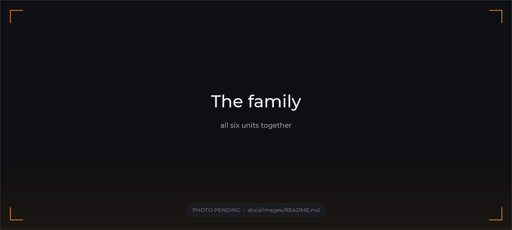

They all run one firmware. A shared core does Sonos discovery, control, browsing, settings,
networking and over-the-air updates; each device adds only its own drivers and its own idea of
what a person should be able to do with it. Adding a sixth form factor is a board directory, a
unit directory and one build env — the core is untouched.

---

## Why these exist

The Sonos app is a good app and a bad light switch. Starting the same playlist in the same room
every night should not require unlocking a phone, waiting for a splash screen, and finding a
room picker. So: a button that does one thing, a knob that does volume, a panel on the wall that
is always already on.

Everything here speaks the **local UPnP/SOAP API** that Sonos speakers have always served on
port 1400. That is what makes standalone possible — and it is also the project's main durability
risk, which the docs are honest about rather than quiet about.

---

## The devices

### sonos-jukebox — the wall panel

A 7" landscape touchscreen on an **ESP32-P4**, wall-mounted, always awake. Six screens off a
nav rail — Now Playing, Favorites, Radio, Search, Rooms, Settings — a physical dial, and album art.

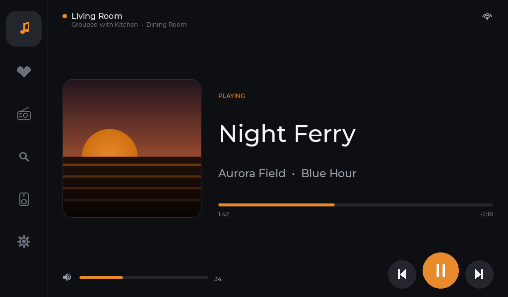

Twist the dial for volume from any page, press it for play/pause. Now Playing is **event-driven**
— Sonos pushes state changes over GENA, so the panel is live without polling the network to
death (3.00 SOAP calls/sec became 0.09).

<table>
<tr>
<td width="50%">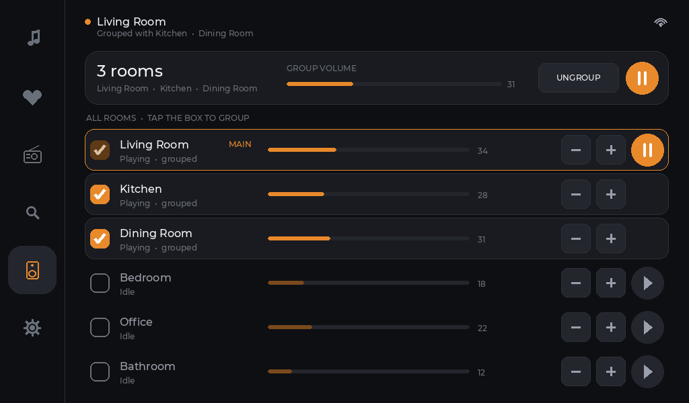</td>
<td width="50%">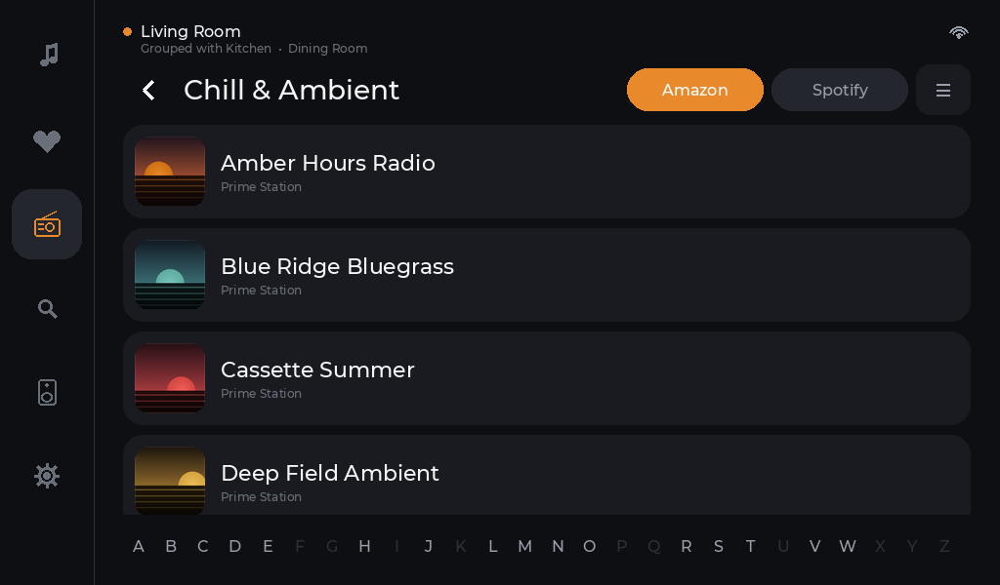</td>
</tr>
<tr>
<td><b>Rooms</b> — a checkbox per room joins or leaves the active group, with per-room volume,
per-room play/pause, and a group summary bar over the top. Live volume and transport for every
room, polled only while you are looking at the page.</td>
<td><b>Radio</b> — two sources behind one toggle, never blended. <b>Amazon</b>: 26 genres and
~1,050 Prime Stations crawled onto the SD card with artwork, an A–Z jump strip and a global
search. <b>Spotify</b>: charts, playlists, genres and your own library, browsed live. No Sonos app
involved, at any point.</td>
</tr>
</table>

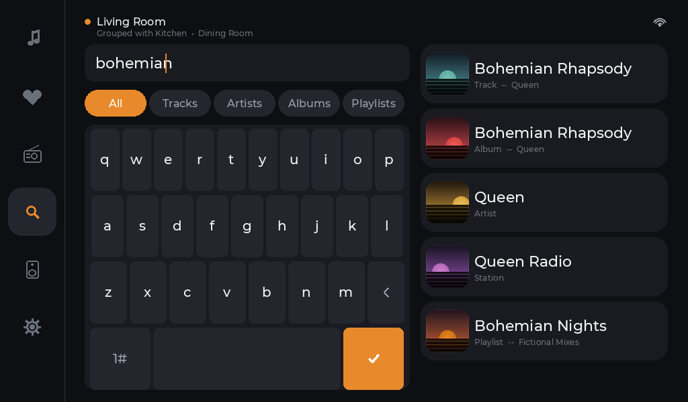

**Search** is the one screen that goes out to a music service live. Type, and results arrive in
about a second — tracks, artists, albums, playlists, and an artist's own radio. Tap a track and it
plays; tap an album or an artist and it opens, because containers are browsed rather than guessed
at. The device holds **its own Spotify account**, linked once by scanning a QR on the panel; no
Sonos app, no cloud service of ours, and nothing on the network but the speakers.

The layout is the screen shape doing work: a full-width keyboard on a 600 px-tall panel leaves
room for one result, so the keyboard takes the left 484 px and the results the right 380 — both
permanent, nothing to dismiss. The keymap is cut down to what a music query actually contains,
which is why there is no `$ % ^ &` and no close button.

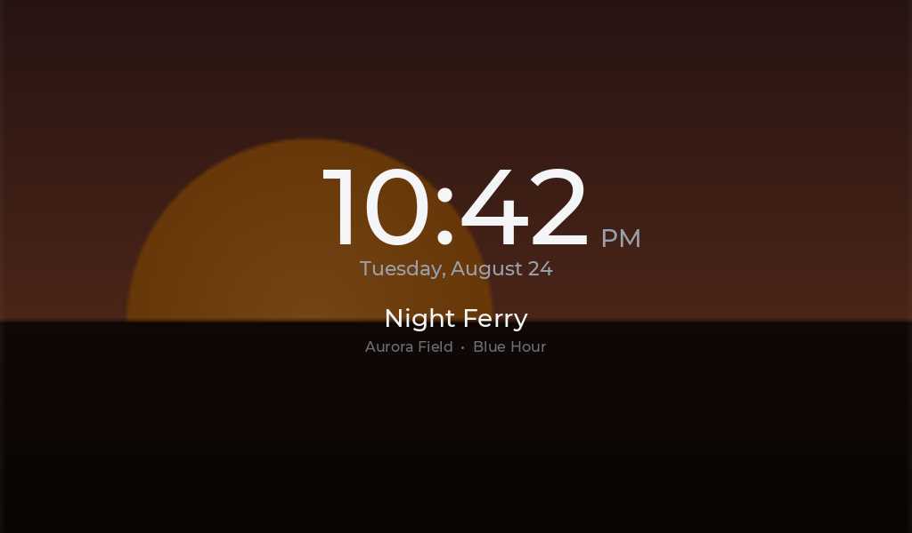

After a while it becomes a clock, with the current album art washed full-bleed behind a 50 %
scrim and the backlight dropped. That is a real 120 px font, not a scaled-up label — scaling one
would allocate a quarter-megabyte draw layer on every repaint, out of a pool whose exhaustion
freezes the UI rather than dropping a frame.

> **Also on it:** Sonos Favorites off an SD cache, Wi-Fi setup, OTA, and UI click feedback
> through the onboard speakers.
> **Not done:** the four transport buttons (a PCF8574 on the shared I²C bus) and the case.
>
> **Read before touching it:** [`plans/07-sonos-jukebox.md`](plans/07-sonos-jukebox.md) — this is
> RISC-V silicon on a different toolchain, and several of its failure modes are silent.
> Screensaver: [`plans/10`](plans/10-jukebox-screensaver.md) · Radio and the music-service
> research: [`plans/08`](plans/08-music-service-integration.md) · Search, the Radio sources, and
> the six hardware-only bugs building them turned up:
> [`plans/12`](plans/12-jukebox-search.md) · eventing: [`plans/09`](plans/09-gena-eventing.md).

---

### sonos-nest — the knob

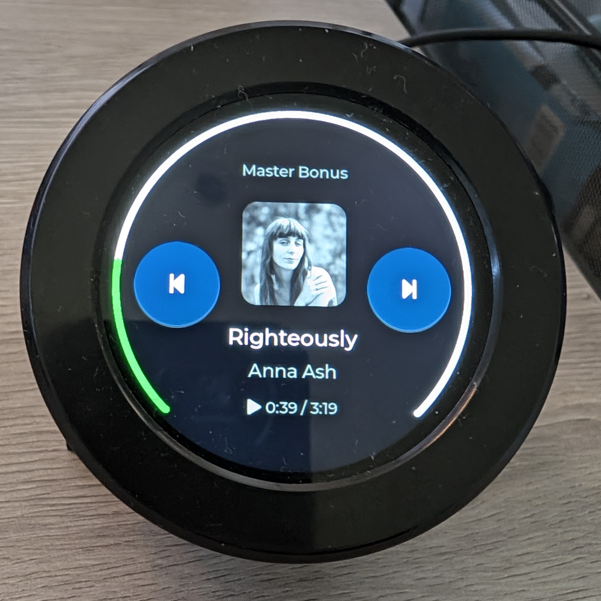

The original. A **round 480×480 display** with a real rotary encoder and a knob you press, on an
ELECROW CrowPanel 2.1". Wall-mounted on a magnetic pull-off cradle.

- **Twist** = volume. **Press** = play/pause.
- **Swipe right** = menu, **up** = queue, **down** = clock. Long-press on a list = back.
- Screens: Now Playing, Menu, Rooms, Group, Playlists/Favorites, Settings, Clock.

The front bezel rotates, so it is mounted **from the rear only** — see
[`hardware/round-nest-2.8/`](hardware/round-nest-2.8/).

**→ [Full guide: docs/sonos-nest.md](docs/sonos-nest.md)**

---

### sonos-sleep-machine — the nightstand player

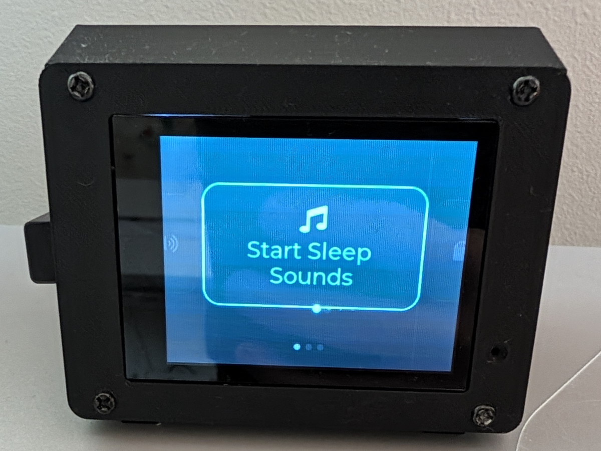

A 2.8" touch unit that plays sleep sounds three different ways, and listens for its name.

- **Three outputs**, picked from a home carousel: the Sonos speaker's own library · an SD file
  **streamed to Sonos** over HTTP · or the SD file straight out of **its own speaker** (ES8311
  codec + Helix MP3 decode).
- **Voice control.** Three custom wake words were trained for it; two ship. *"Kinder Bedtime"*
  starts the Sonos sleep playlist, *"Wake-Up"* stops it — each calls the exact same callback as
  its on-screen button, so voice and touch cannot drift apart.
- **A Wake track**, swapped in on whichever output is already playing, at the current volume.
- **A web file manager** on `:8080` for loading MP3s onto the card without pulling it out.
- A sleep timer, and a screensaver that dims while playing.

**→ [Full guide: docs/sonos-sleep-machine.md](docs/sonos-sleep-machine.md)** ·
wake-word story: [`plans/03`](plans/03-wake-word-integration.md)

---

### sonos-button — one button, no screen

<table>
<tr>
<td width="50%">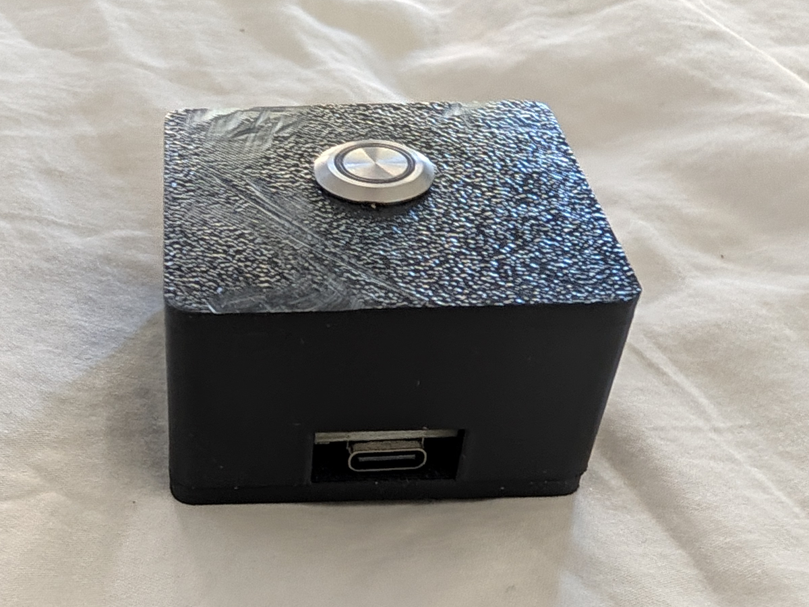</td>
<td width="50%">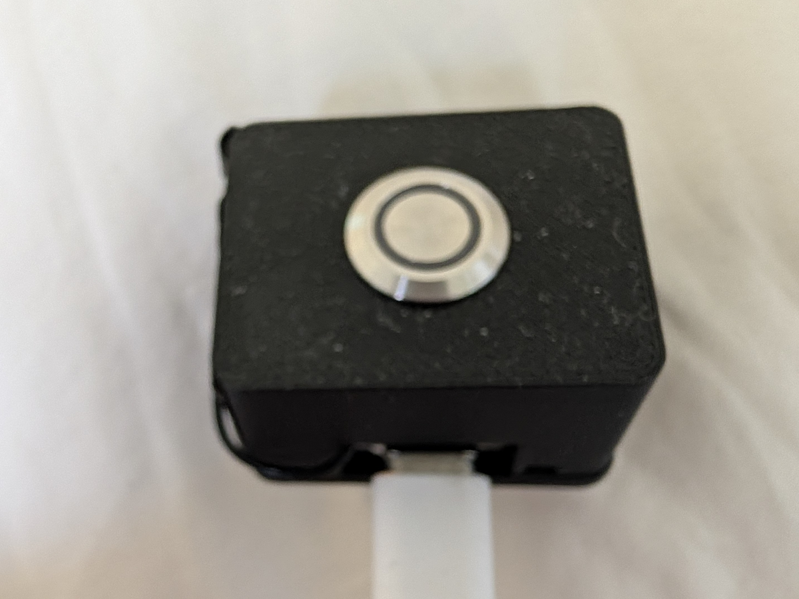</td>
</tr>
<tr>
<td><b>sonos-button</b> — ESP32-S3-CAM, 57.1 cm³, taped under a nightstand with the button
facing down.</td>
<td><b>sonos-button-v2</b> — the identical product on a Seeed XIAO ESP32S3 (21 × 17.8 mm, ~$7).
Same firmware unit, unchanged. <b>24.5 cm³ — 2.3× smaller.</b></td>
</tr>
</table>

Press it: the configured room starts the configured saved playlist, looped, at the configured
volume. Press again: stop. **Double-press and triple-press each start their own playlist and
volume**, so one button covers three moods.

It is headless — there is genuinely no screen — so everything is set up in a browser: a SoftAP
captive portal for Wi-Fi, then a config page on `:8080` for room, playlists, volume, ring
brightness and device name. It also mirrors its log over TCP on `:2323`, which on a device with
no display is the only way to watch it think.

> The single press deliberately costs ~350 ms, because a release is only a *single* press once
> the multi-press window closes. That is why the ring pulses on the press **edge** rather than on
> the classified event: feedback a third of a second after your finger reads as a missed press.

**→ [plans/04 — the button](plans/04-sonos-button-plan.md)** ·
[**plans/11 — why the XIAO**](plans/11-button-v2.md) ·
cases: [`hardware/cam-button/`](hardware/cam-button/) · [`hardware/button-v2/`](hardware/button-v2/)

---

## One dashboard, if you want one

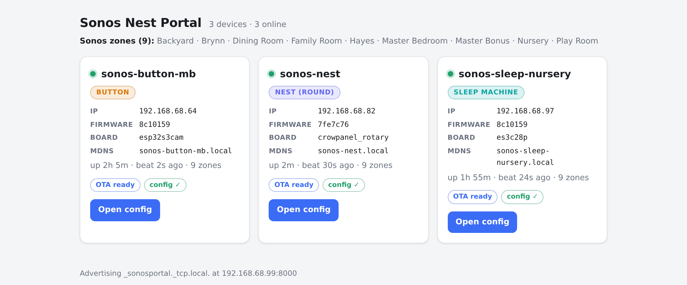

[`sonos-portal/`](sonos-portal/) is a small **local** web dashboard that every unit registers
itself with at boot and then heartbeats. One page listing every device on the LAN, its firmware
version, whether it is online, and a click into its own config page.

**It is entirely optional.** The devices are standalone; nothing here is needed to build, flash
or use any of them. If the portal is offline, registration is a best-effort outbound POST that
simply fails and the device carries on. Discovery is automatic — the portal advertises
`_sonosportal._tcp` over mDNS and the firmware's `core/net/registrar` finds it, so there is no
per-device configuration. Because mDNS is multicast, the portal has to sit on the same L2
network as the devices (host networking on a real Linux box, not a NAT'd VM).

Run it as a **Home Assistant add-on** ([walkthrough](sonos-portal/INSTALL-HOMEASSISTANT.md)) or
as **standalone Docker** on any always-on host:

```bash
git clone https://github.com/wjduenow/sonos-nest
cd sonos-nest/sonos-portal
docker compose up -d --build  # host networking; dashboard at http://<host-ip>:8000
```

It also serves firmware for **pull-based OTA**, so devices can update themselves from the LAN
instead of GitHub — [`plans/06`](plans/06-scalable-ota.md).

---

## At a glance

| Unit | Board | SoC | Screen | Build env | Guide |
|------|-------|-----|--------|-----------|-------|
| **sonos-jukebox** | ELECROW CrowPanel Advance 7" | ESP32-P4 (+ C6 for Wi-Fi) | 1024×600 MIPI-DSI | `sonos-jukebox` | [plans/07](plans/07-sonos-jukebox.md) |
| **sonos-nest** | ELECROW CrowPanel 2.1" round | ESP32-S3R8 | 480×480 round | `nest` | [docs](docs/sonos-nest.md) |
| **sonos-sleep-machine** | Hosyond/LCDWIKI ES3C28P 2.8" | ESP32-S3R8 | 240×320 | `sleep-machine` | [docs](docs/sonos-sleep-machine.md) |
| **sonos-button** | nulllab/emakefun ESP32-S3-CAM | ESP32-S3 | — headless | `sleep-button` | [plans/04](plans/04-sonos-button-plan.md) |
| **sonos-button-v2** | Seeed XIAO ESP32S3 | ESP32-S3R8 | — headless | `button-v2` | [plans/11](plans/11-button-v2.md) |

Every unit ships Wi-Fi provisioning over a captive portal, mDNS, ArduinoOTA, pull-OTA and portal
self-registration, because all of that lives in the shared core.

---

## How it fits together

Three layers, selected per build env by `build_src_filter`:

```
src/
  main.cpp              boardInit() -> uiInit() -> appBoot() -> appStartTasks()
  core/                 device-agnostic — compiled into EVERY unit
    app.*               zone/coordinator selection, command dispatch, the three tasks
    player_state.*      mutex-guarded now-playing state + pending commands
    library.*           async browse/play — playlists, favorites, queue
    settings.*          NVS: default room, brightness, cached zone IPs
    webconfig.*         what a board's web UI may configure, and how it is applied
    room_status.*       per-room volume + transport, polled only while a page asks
    radio_cache · fav_cache · amazon    SD-backed catalogues (jukebox)
    board.h             the HAL contract every board implements
    unit.h              the UX contract every unit implements (uiInit / uiTick)
    sonos/              soap_client · ssdp discovery · DIDL-Lite parser · gena eventing
    net/                wifi · ota · updater · captive portal · registrar · logmirror
    ui/                 the ONLY LVGL-coupled part of core — headless envs drop it wholesale
  boards/               drivers, one dir per board (+ button_common/, shared by both buttons)
  units/                UX, one dir per unit
```

**The seam:** the UI never calls Sonos or SOAP, and never touches a pin. It reads and writes the
mutex-guarded `g_player` / `g_pending` and the `library::` / `sonos::` / `settings*` APIs, and
reaches hardware only through free functions in `core/board.h`. That is why a screenless unit is
a first-class citizen instead of a pile of `#ifdef`s.

Three FreeRTOS tasks, created in `core/app.cpp`: **uiTask** (core 1) renders and reads input;
**netTask** (core 0) drains queued commands and polls transport, position and volume; **artTask**
(core 0) fetches and decodes album art on track change.

**Architecture rationale:** [`plans/02`](plans/02-multi-unit-reorg.html) ·
**the full design dossier and feature scorecard:** [`plans/01`](plans/01-sonos-knob-controller-plan.md)

---

## Build it

[PlatformIO](https://platformio.org/) + Arduino + LVGL 9. Build with **`tools/pio`**, which takes
the same arguments as `pio` — the units span two different SoCs whose toolchains otherwise evict
each other from PlatformIO's single global package directory, and the wrapper gives each its own
tree.

```bash
tools/pio run -e nest                                        # build
tools/pio run -e nest -t upload --upload-port /dev/ttyACMx   # USB flash
tools/pio run -e sonos-jukebox                               # the ESP32-P4 panel
```

Then copy `include/secrets.example.h` → `include/secrets.h`. **Wi-Fi credentials are optional** —
leave them blank and the device raises an open SoftAP captive portal named `<hostname>-setup` on
first boot, lists nearby networks, and reverts cleanly on a wrong password so a typo cannot
strand it. Hold the knob or button through power-on to re-provision.

- **Full setup, disk budget, the package-tree split, CI:** [`docs/dev-setup.md`](docs/dev-setup.md)
- **Flashing from WSL2** (usbipd, port renumbering, the reader script):
  [`docs/flashing-wsl.md`](docs/flashing-wsl.md)
- **Wireless flashing:** the `/ota` skill in [`.claude/skills/ota`](.claude/skills/ota)
- **Enclosures** — all Python CSG (trimesh + manifold3d), each part asserting its own clearances
  at build time: [`hardware/README.md`](hardware/README.md)

CI builds all five app envs on every PR and every push to `main`.

---

## Documentation map

| If you want to… | Read |
|---|---|
| Understand the whole project | [`plans/01-sonos-knob-controller-plan.md`](plans/01-sonos-knob-controller-plan.md) |
| Set up a dev machine | [`docs/dev-setup.md`](docs/dev-setup.md) |
| Flash from WSL | [`docs/flashing-wsl.md`](docs/flashing-wsl.md) |
| Work on the jukebox | [`plans/07`](plans/07-sonos-jukebox.md), then [`plans/10`](plans/10-jukebox-screensaver.md) |
| Add a music service, or know why one is impossible | [`plans/08`](plans/08-music-service-integration.md) |
| Touch `core/spotify`, `core/smapi` or the artwork cache | [`plans/12`](plans/12-jukebox-search.md) § 12 first |
| Train a wake word | [`plans/03`](plans/03-wake-word-integration.md), [`training/wake-word/`](training/wake-word/) |
| Run the portal | [`sonos-portal/README.md`](sonos-portal/README.md) |
| Ship firmware to many devices | [`plans/06-scalable-ota.md`](plans/06-scalable-ota.md) |
| Add a new board or unit | [`plans/02`](plans/02-multi-unit-reorg.html), [`src/core/ui/README.md`](src/core/ui/README.md), [`src/boards/button_common/README.md`](src/boards/button_common/README.md) |
| Print a case | [`hardware/README.md`](hardware/README.md) |
| Regenerate the images in this README | [`docs/images/README.md`](docs/images/README.md) |

**Working on this codebase with an agent?** [`CLAUDE.md`](CLAUDE.md) is the real map — every
gotcha that cost someone a day is written down there, at length, with the reason.

---

## Status

The jukebox, nest, sleep-machine and both buttons all work and are in daily use. Known open
items: the jukebox's four transport buttons and its case; the sleep-machine's RGB LED; a third
wake word that trains but does not fire; and one unresolved ESP-Hosted link fault on the P4 that
recovers by reboot rather than being cured. On Search, playing a track is proven on hardware and
playing an artist *station* is not yet. Each is written up where it lives.

Sonos is a third party and is not affiliated with this project.
