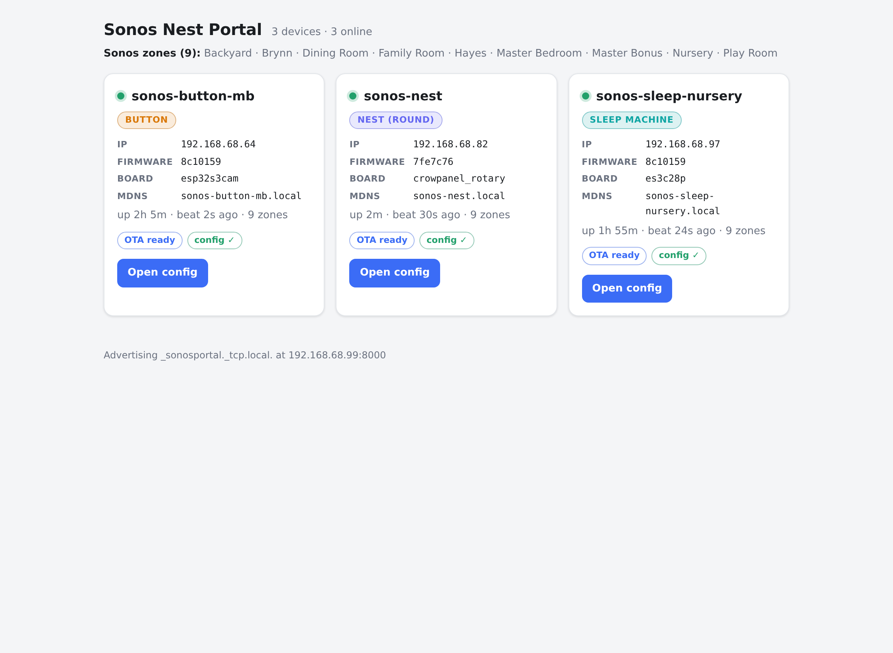

# sonos-nest

Firmware for **standalone physical Sonos controllers** — small ESP32-S3 appliances that talk
**directly** to Sonos speakers over the local UPnP/SOAP API (no server, no cloud). One
codebase drives multiple hardware units and UX treatments from a shared core.

Full design + research dossier: [`plans/01-sonos-knob-controller-plan.md`](plans/01-sonos-knob-controller-plan.md).
Multi-unit reorg rationale: [`plans/02-multi-unit-reorg.html`](plans/02-multi-unit-reorg.html).

## Units

| Unit | Board | Form factor / UX | Use case | Build env |
|------|-------|------------------|----------|-----------|
| **[sonos-nest](docs/sonos-nest.md)** | ELECROW CrowPanel 2.1" (ST7701 480×480 round, EC11 rotary encoder + knob button, CST816 touch, PCF8574 expander) | Round rotary knob — twist = volume, press = play/pause, touch/gesture to browse | Wall-mounted knob controller | `nest` |
| **[sonos-sleep-machine](docs/sonos-sleep-machine.md)** | Hosyond/LCDWIKI ES3C28P 2.8" (ILI9341 240×320 SPI, FT6336 touch, microSD, ES8311 codec + speaker, mic, RGB-LED) | Rectangular, touch-first | Nightstand sleep-sound player — plays off its SD card or through Sonos, with a wake track and a web UI for managing the card | `sleep-machine` |
| **[sonos-button](plans/04-sonos-button-plan.md)** | nulllab/emakefun ESP32-S3-CAM (one physical button, illuminated ring LED, no screen; 8 MB flash) | Headless single button — press = start the configured Sonos sleep playlist (looped) at a set volume, press again = stop; ring shows feedback | One-touch bedside "start my playlist" button; all setup via a browser (SoftAP captive portal for WiFi + a `:8080` config page for room/playlist/volume/ring/name) | `sleep-button` |

**→ Full guides: [sonos-nest](docs/sonos-nest.md) · [sonos-sleep-machine](docs/sonos-sleep-machine.md)** ·
[sonos-button](plans/04-sonos-button-plan.md) — hardware, cases, features, setup and day-to-day
management for each unit.

All three share one **core** — Sonos control, discovery, browsing, settings, networking, OTA, and
portal self-registration — and differ only in their board drivers and UX. The nest and
sleep-machine run an **ESP32-S3R8** (8 MB OPI PSRAM, 16 MB flash) with a screen; the button is
**headless** on an ESP32-S3-CAM (8 MB flash), configured entirely from a browser.

## Portal — one dashboard your devices register with

[`sonos-portal/`](sonos-portal/) is a small **local** web dashboard that every unit
self-registers with, so you have one place that lists all your devices on the LAN with a
single click into each one's web config — plus online/offline status and firmware version.
It's optional; the units work fine without it.



- **Discovery is automatic.** The portal advertises `_sonosportal._tcp` over mDNS; each device
  finds it and registers at boot, then heartbeats. Self-registration is built into the shared
  **core** (`core/net/registrar.*`), so *every* unit ships it (registration is an outbound POST,
  independent of whether the unit serves a web page). No per-device configuration.
- **Requires the same LAN.** mDNS is multicast, so the portal must run on the same L2 network as
  your devices — host networking on a real Linux box, not a NAT'd VM or Docker Desktop.

### Two ways to run it

1. **Home Assistant add-on.** Add this repo as a custom add-on repository
   (`https://github.com/wjduenow/sonos-nest`) and install **Sonos Nest Portal** — the Supervisor
   builds it on-device, and it shows up in the HA sidebar. Needs a Supervisor-based HA (HAOS or
   Supervised). Full walkthrough: [`sonos-portal/INSTALL-HOMEASSISTANT.md`](sonos-portal/INSTALL-HOMEASSISTANT.md).

2. **Standalone Docker** on any always-on Linux host on your LAN (Raspberry Pi, NAS, etc.):
   ```bash
   git clone https://github.com/wjduenow/sonos-nest
   cd sonos-nest/sonos-portal
   docker compose up -d          # host networking; dashboard at http://<host-ip>:8000
   ```
   The compose uses `restart: unless-stopped` + a `/health` check (and an `autoheal` label), so
   it self-recovers. Details: [`sonos-portal/README.md`](sonos-portal/README.md).

## Architecture — shared core + pluggable board/unit

```
src/
  main.cpp              thin entry: boardInit → uiInit → appBoot → appStartTasks
  core/                 device-agnostic — compiled into EVERY unit
    app.{h,cpp}         controller: zone select, command dispatch, poll tasks (ui/net/art)
    player_state.{h,cpp}  mutex-guarded shared now-playing state + pending commands
    library.{h,cpp}     async ContentDirectory browse/play (playlists/favorites/queue)
    settings.{h,cpp}    NVS (default room, brightness, cached zone IPs)
    album_art.{h,cpp}   art fetch + TJpg decode → LVGL image (off the UI thread)
    board.h             HAL contract every board implements
    unit.h              UX contract every unit implements (uiInit/uiTick)
    sonos/              soap_client · ssdp (discovery) · didl (DIDL-Lite parser)
    net/                wifi · ota · portal (SoftAP captive-portal WiFi setup) · registrar
  boards/               one dir per board — implements board.h
    crowpanel_rotary/   ST7701 display · CST816 touch · EC11 encoder · PCF8574 · pins.h
    es3c28p/            ILI9341 display · FT6336 touch · microSD · ES8311 audio · web server
    esp32s3cam/         single button · illuminated ring LED · config web server (headless)
  units/                one dir per UX — implements unit.h
    sonos_nest/         round/rotary LVGL screens + ui_scale.h (480×480)
    sleep_machine/      touch screens + ui_scale.h (320×240 landscape)
    sleep_button/       headless — no screen; button press → play/stop, browser config
hardware/               3D-printed mounts/cases (user-owned; see hardware/README.md)
plans/                  design plans + reorg doc
docs/                   per-unit guides + flashing-wsl.md
include/                lv_conf.h, secrets.h (gitignored)
```

**How the seam works:** the UI never calls Sonos/SOAP directly — it reads/writes the
mutex-guarded globals `g_player` / `g_pending` (`core/player_state.h`) and the
`library::` / `sonos::` / `settings*` APIs. A unit talks to hardware only through the free
functions in `core/board.h` (`boardInit`, `backlightSet`, `encoderDelta`, `knobEvent`…).
Each PlatformIO env selects exactly one board + one unit + the core via `build_src_filter`,
and sets `-DDEVICE_HOSTNAME` (per-unit mDNS/OTA name). Adding a new form factor = a new
`boards/<board>/` + `units/<unit>/` + one env; the core is untouched.

## Build / flash

[PlatformIO](https://platformio.org/) + Arduino. Libraries: LVGL 9.x, GFX Library for
Arduino (pinned v1.3.1 — has both ST7701 RGB and ILI9341 SPI drivers), ArduinoJson,
TJpg_Decoder, ESP32Encoder.

```bash
pio run -e nest                       # build the nest app (default env)
pio run -e nest -t upload --upload-port /dev/ttyACMx   # USB flash
pio run -e sleep-machine              # build the sleep-machine app
```

Env variants: `nest-bringup` (Phase-0 hardware self-test), `nest-phase1` (interactive SOAP
test), `nest-ota` / `sleep-machine-ota` (WiFi flash via espota).

On **WSL2 (Windows)**, USB needs bridging first — see
[`docs/flashing-wsl.md`](docs/flashing-wsl.md). Wireless flashing uses the `/ota` skill.

### First-time setup

1. `pio run -e nest` once to fetch libraries.
2. Copy `include/secrets.example.h` → `include/secrets.h`. WiFi creds (`WIFI_SSID` / `WIFI_PASS`)
   are **optional** — set them to bake WiFi in at flash time, or leave them blank and provision
   over the air on first boot (below). Set `OTA_PASSWORD` (required for wireless flashing);
   `SONOS_DEFAULT_ROOM` and `CLOCK_TZ` are optional.

### Initial WiFi setup — captive portal (all units)

On a first boot with **no stored credentials**, every unit raises an open **SoftAP captive
portal** named `<hostname>-setup` (`sonos-nest-setup`, `sonos-sleep-setup`,
`sonos-button-setup`):

1. Join that network from a phone. The "sign in to network" sheet pops automatically (wildcard
   DNS) and lists nearby WiFi networks.
2. Pick yours, enter the password, submit. The device applies it through the same path that
   persists on success and **reverts on a bad password** (a typo can't strand it), tears the AP
   down, and continues booting — now on your network.

Screened units (nest, sleep-machine) show a **"Wi-Fi Setup — join `<AP>`"** message on-screen
while the portal is up; the headless button has no screen, so the AP *is* the whole setup UI.

**Re-provisioning** (new network, wrong password): hold the knob/button through power-on to force
the portal open again. The sleep-machine (no knob) can also change networks any time from its
on-screen **Wi-Fi** setting. Credentials live in NVS and survive reflashing, so a normal OTA/USB
update keeps the device on its network.

## Hardware (enclosures)

3D-printed mounts and cases live in [`hardware/`](hardware/) — one directory per unit
(`round-nest-2.8/` for the round CrowPanel, `rec-2.8/` for the ES3C28P), generated with a
Python CSG toolchain. This is user-owned mechanical work kept **separate** from firmware
commits. See [`hardware/README.md`](hardware/README.md).
