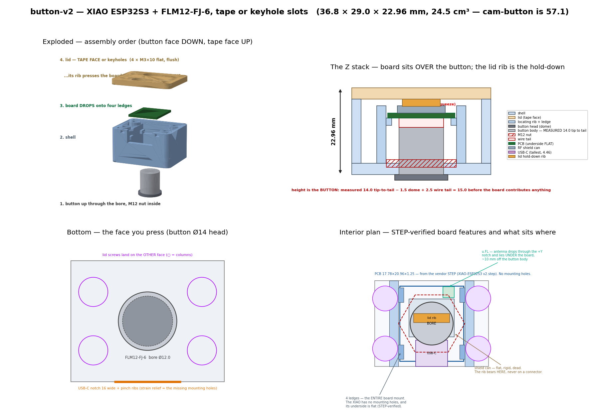

# button-v2 — the `button-v2` case

Enclosure for the **fifth unit**: a **Seeed XIAO ESP32S3** plus one **FILN FLM12-FJ-6**
pushbutton. Same product as [`../cam-button`](../cam-button/README.md) — press it and the
configured Sonos room starts the configured playlist, looped — on a board a quarter the size,
in a box **half the volume**.

Firmware plan (why this board, pinout, phases): **`../../plans/11-button-v2.md`**.

| | |
|---|---|
| **Overall** | **36.78 × 29.00 × 22.96 mm** — height is **derived**, never typed (see §2) |
| **Volume** | **24.5 cm³** vs cam-button's 57.1 — **2.33× smaller** |
| **Tape face** | 36.8 × 29.0 = **1067 mm²**, flat, printed against the bed, **6 holes** |
| Parts | `shell/shell.stl` + `shell/lid.stl` |
| Screws | **4 × M3 self-tapping** — half what the cam-button needs, because the board has none |
| Mounting | VHB tape **or** two keyhole slots, same face |



---

## 1. The idea: the board sits **over** the button

`plans/04` §6 costed three layouts for the cam-button and rejected "bore **over** the board" at
~37.5 mm tall. That verdict was about *that board*: an ESP32-S3-CAM is 30.4 × 38.4 mm with
14.5 mm of pre-soldered header stack hanging off it, so putting it above the button stacked two
tall things. The cam-button escaped by threading the Ø12 body through the channel between its
two header rows.

The XIAO has **no headers and no through-board parts at all**, so the rejected layout becomes
the right one:

| layout | height | floor |
|---|---|---|
| cam-button: bore in the header channel | 26.81 mm | 48.2 × 44.2 |
| **button-v2: board flat over the button's back** | **22.96 mm** | **36.8 × 29.0** |

**Height here is the *button*, not the board:**

```
BUTTON_OVERALL_T  14.00   MEASURED, dome top -> back of the connector
− BUTTON_HEAD_T    1.50   the dome, which lives OUTSIDE the box
+ BUTTON_TAIL_T    2.50   wires leaving the connector and turning
                  -----
                  15.00   before the board contributes a single millimetre
```

The board swap buys **footprint** — 2130 mm² → 1067 mm², less than half. The **height** came from
calipering the button, which is the point `plans/04` §6 kept making: at 26.31 mm (the datasheet
reading) this box was barely under the cam-button, and one measurement took 3.35 mm off it.

> **It also clears the 23 mm target** `plans/04` §6 set and the cam-button never reached — its
> README concludes 23 is "reachable, but only if one of the two caliper checks goes the optimistic
> way… not reachable with both pessimistic". The check came back optimistic.

### The underside is flat, and it is load-bearing

The whole retention scheme rests on it, so it is **checked, not assumed**. `build_shell.py`
asserts it every build, and the number comes from scanning every solid in the vendor STEP:

```
lowest point of ANY body, measured from the PCB's back face:  0.000 mm
```

That is the PCB itself. There is no bottom-side B2B connector (that is a Sense-kit part), and
none of the soldered JSTs the cam-button had to route its bore around. So the board can seat on
plain ledges anywhere, and nothing beneath it needs clearance.

---

## 2. Where every number came from

The honest ledger. **Read this before printing** — the ⚠️ rows are the ones that move metal.

### From the vendor STEP (as good as CAD gets, short of calipers)

Source: [the Seeed wiki's Mechanical Design
section](https://wiki.seeedstudio.com/xiao_esp32s3_getting_started/) →
`seeed-studio-xiao-esp32s3-3d_model.zip` → `XIAO-ESP32S3 v2.step`. **The file is in metres.**

| what | value | how |
|---|---|---|
| PCB outline | **17.78 × 20.96 × 1.25** | the board solid, exactly |
| mounting holes | **none** | there are none to find — see §3 |
| bottom-side parts | **none** | min Z of every body = 0.000, the PCB itself |
| tallest top-side part | **4.46** above the PCB back face (the USB-C shell) | next: shield can 3.25, u.FL 2.50, BOOT/RESET 1.98 |
| USB-C | centred (x ±4.47) on the −Y short edge, **8.94 wide**, overhangs the PCB edge by **1.52** | connector bodies |
| RF shield can | **12.60 × 10.60**, top at **3.25** | the flat, rigid, dead surface the lid rib bears on |
| u.FL | **3.0 × 3.1** at the **+Y** end, top at 2.50 | the antenna connector |
| BOOT / RESET | top side, flanking the USB-C, 1.98 tall | two small tacts |

> **PCB_W is 17.78 = exactly 0.700″**, which is why published sources split between "17.5" and
> "17.8". The CAD settles it.

> **⚠️ The STEP was rotated 180° about Z to land the USB-C at −Y, matching the cam-button's
> convention. That is a determinant **+1** transform on purpose.** The obvious move — flip a
> single axis — is a *mirror*, and it silently swaps the board's left and right, which would put
> the u.FL and the solder pads on the wrong sides of every drawing here. The Y positions are
> unaffected either way; only the X handedness is at stake, which is why the u.FL notch (§3) is
> cut across the full width rather than at the connector's exact X.

### The button, MEASURED — and it settles `plans/04`'s oldest open question

**Calipered 2026-08-19: 14.0 mm tip to tail, dome top → back of the connector.**

`plans/04` §7.1a and `../cam-button`'s risk list #1 have been arguing about this since the button
was chosen, and the measurement contradicts **both** readings of the datasheet:

| reading | implied overall |
|---|---|
| "13.35 = behind-panel depth, plus a 1.5 head" | 14.85 — **0.85 too tall** |
| "13.35 = overall, head included" | 13.35 — **0.65 too short** |
| **measured** | **14.00** |

It also folds in something the old parameterisation guessed at separately: the measurement runs
to the **back of the connector**, so whatever hangs off the switch's rear is already inside the
14.0 and `BUTTON_TAIL_T` no longer has to reserve room for it.

> **⚠️ Watch the datum if you copy numbers between the two cases.** `../cam-button` stores
> `BUTTON_BEHIND_T` from the panel's **inner** face and builds its stack as
> `PANEL_T + BEHIND_T + TAIL_T`. Here, subtracting the dome from a tip-to-tail measurement gives
> `BUTTON_INSIDE_T` from the panel's **outer** face — which already contains the panel. Adding
> `PANEL_T` to it double-counts 2 mm. That is why the constant has a different name.

### ⚠️ NOT VERIFIED — the real risk list

| # | flag | worth | status |
|---|---|---|---|
| 1 | **`BUTTON_HEAD_T` 1.5** — how far the dome stands proud of the panel's outer face. The only unmeasured term left in the height, and it maps **1:1** into it, because `BUTTON_INSIDE_T` is whatever is left of the measured 14.0 | **1 mm per mm** | datasheet value; caliper it next |
| 2 | `BUTTON_THREAD_L` 4.0 / `BUTTON_NUT_T` 2.0 → `BUTTON_PANEL_T` **2.0** | the panel exists or it doesn't | drives the nut relief |
| 3 | `BUTTON_TAIL_T` 2.5 — wire bend behind the connector | 2.5 mm | far less fraught than the cam-button's: no pigtail coil to hide (§3) |
| 4 | `BUTTON_BORE_D` 12.0 | fit | FDM prints holes undersize — **test-coupon it** |
| 5 | **u.FL antenna RF, in a closed box, 10 mm from a Ø14 metal button** | range | the one thing the board swap genuinely regresses — see §5 |
| 6 | `PCB_CORNER` R2 | nothing | the pocket is looser than the PCB on every side |

> **`../cam-button` is stale against this measurement and has NOT been regenerated.** Its params
> still carry the disputed 13.35, so its box is ~3 mm taller than it needs to be. That case may
> already be printed, so re-deriving it is a call for whoever owns the printed one — see §7.

---

## 3. Layout decisions

**The orientation is forced, not chosen.** The nut relief is Ø19.5 and the board is
17.78 × 20.96. The board's **long** axis has to run along the cavity's short axis, because
turning it 90° makes that side 17.78 + gaps = 18.58 < 19.5 and the relief breaks through the
wall. `check_clearances()` proves it on every build.

**⚠️ The cavity's short axis is set by a TOOL, not by the board — and this resized the box.**
Sizing `IN_Y` off the board alone gives 21.76 mm, which fits the M12 nut (18.48 across corners)
with room to spare and is **still wrong**: a 16 mm socket is ~22 mm across, so it misses by a
quarter of a millimetre and the nut can only be pinched up by hand. That is not good enough
here. This button is pressed hundreds of times and every press torques the body; a hand-tight
nut backs off, the button starts to rotate in its bore, and the four soldered wires wind up and
break off. `IN_Y` is therefore `max(board, socket)` = **24.0**, costing 2.24 mm of Y and ~8% of
the volume. The cam-button never had to think about this — its cavity is 39.2 mm in that axis.

It only helps if the socket can *reach* the nut, so **every locating feature starts at
`NUT_ACCESS_Z` = 5.0**, 1 mm above the nut. Below that the cavity is clear wall-to-wall. The ribs
and end packers bridge that gap — a ~20 mm span between two walls, which prints without support
and is an internal face nobody sees.

**Board retention, with no mounting holes.** The XIAO has none, so the board is held by geometry:

1. Two **X locating ribs** at x = ±9.29 and two **Y end packers** at y = ±10.88 form a pocket
   0.4 mm loose all round — the "captured-edge pocket".
2. Four **ledges** at `PCB_BACK_Z` that the board simply drops onto.
3. A **rib on the lid** that presses it down.

**The lid is a structural part here, which it is not on the cam-button.** Take the lid off and
the board is loose. Its rib bears on the **RF shield can** and nothing else — flat, rigid,
12.60 × 10.60, and electrically dead. The two alternatives are both *connectors*: pressing a
board down through a USB-C or a u.FL puts the retention load into a solder joint, which is the
exact failure this scheme exists to prevent. The rib is 10.0 mm against the can's 12.60, so
there is 1.3 mm of slop per side before it overhangs an edge.

**⚠️ The real risk is the USB-C cable, not rattle.** Without mounting holes, every gram of
insertion force lands on the connector's solder joints. The notch therefore carries **pinch ribs**
sized 3 mm under the opening so they grip a 16 mm overmold, plus a **2.5 mm zip-tie slot** either
side for a cable the ribs cannot grip. This is the strain relief standing in for the mounting
holes the board does not have.

**Trim the pigtail to ~40 mm before soldering.** The cam-button coils ~135 mm of excess under its
header pin tips and needs two posts to hold the coil down; that space does not exist here and
does not need to. The four wires are hand-soldered to the pads either way — feed them **up
through the through-holes from the underside and solder on the top face**, so the underside stays
flat against the ledges.

**The antenna lives UNDER the board.** The u.FL is at the +Y end; the coax drops through a notch
in the +Y packer into the open annulus around the button, and the antenna lies against the end
wall — about **10 mm** off the button's Ø14 metal body, versus the cam-button's ~4 mm, which
works. There is 15.35 mm of clear height down there. **The notch is cut across the full width on
purpose**: which side of the board the u.FL ends up on depends on which way round it is dropped
in, and a notch that only works one way is a notch that will be wrong half the time.

**The USB-C notch is open-topped, for the same reasons as the cam-button's.** The cable axis sits
~20.7 mm up, so any opening generous enough for an overmold would break the ceiling anyway;
running it to the rim instead lets the lid cap it and the shell prints **without a single
bridge**. It also makes room for the connector's 1.52 mm overhang past the PCB edge.

**Keyhole slots, and what they cost.** `../cam-button` argues hard against holes in the adhesive
face and cut its BOOT/RESET holes for buying nothing. These buy a whole second mounting route, so
they are in — but they are not free: **159 mm² of a 1067 mm² face, 14.9% of the adhesive area**
(`build_lid.py` prints it). That is why they are sized to a #8/M4 head and not to something
bigger "just in case".

> ⚠️ **16 mm between the two screws is a short span for a 36.8 mm box.** It hangs fine but it
> will rock if you push it sideways, and it wants the box's **long axis vertical** so gravity
> seats it down the slots. Tape is still the primary mount. The geometry is forced from both
> sides: the lid is 29.0 in Y so a Ø8 head plus edge margin caps the offset at ~8, and the lid
> screws at (±13.0, ±7.0) cap the slot length at ±7.5.

**No BOOT / RESET access**, for exactly the cam-button's reason: both tacts are top-side, so the
only face they could be poked through is the adhesive face, and only the *first* USB flash needs
download mode — done with the case open. After that auto-reset works and `/ota` takes over.

---

## 4. Screws (BOM)

**Half the cam-button's fastener count**, because the board has no mounting holes to screw
through. Everything threads into bare printed plastic: use **self-tapping / thread-forming**
screws (Plastite/PT or generic coarse-thread). **No nuts, no heat-set inserts.**

| Where | Qty | Screw | Length | Head |
|---|---|---|---|---|
| **Lid → shell** | 4 | M3 self-tapping | **10 mm** | **Flat / 90° countersunk** |
| **Board** | 0 | — | — | held by ledges + the lid rib |
| **Button** | 1 | M12 × 0.75 hex nut, 16 A/F | — | supplied with the FLM12-FJ-6 |
| **Keyhole mount** (optional) | 2 | #8 or M4 pan head | — | into the wall/shelf, ~16 mm apart |

- **Lid (4×): M3 × 10 flat-head.** Ø2.6 pilots in the columns, **7.00 mm of bite**, Ø5.0
  countersink. **Flat is mandatory** — this face is the adhesive face, and a round head is a bump
  under the tape. The same screw as the cam-button's lid and the sleep-machine's bezel.
- Pilot size is `LID_POST_PILOT` in `shell/button_params.py`; switch to M3 heat-set inserts +
  machine screws there if you want repeated disassembly.

**Assembly order** (the exploded panel of the preview): button up through the bore and **nut
tightened with a 16 mm socket while the shell is otherwise empty** → four wires soldered to the
XIAO → board dropped onto the ledges → antenna tucked under the +Y end → lid on.

---

## 5. Print

| part | orientation | supports |
|---|---|---|
| **shell** | **button face DOWN** on the bed (as modelled, z=0 down) | **none** |
| **lid** | **TAPE FACE DOWN** on the bed | **none** |

- **shell:** the bore, the pilots and the nut relief are vertical; the ribs, packers and columns
  rise from the bed; the USB notch is open-topped. The only unsupported feature is the underside
  of the ribs and packers at z = 5.0, which bridges ~20 mm wall-to-wall. ~13.0 cm³.
- **lid:** tape face **down** puts the adhesive on a bed-smooth surface — the best face an FDM
  printer can make, and the whole point of the part. The countersinks, the keyhole slots and the
  hold-down rib all open **upward** and need no support. ~2.7 cm³.
- PLA/PETG both fine, 0.2 mm layers, **15% infill** — pressing the button pushes the case **up**
  into the mount, so this is a static compression part.
- **Test-coupon the bore first.** `BUTTON_BORE_D` = 12.0 is thread (11.71) + 0.3, and FDM prints
  holes undersize. Print a 5 mm slab with the bore and check the button threads through before
  committing the shell.
- **Check the lid rib after printing.** It projects 1.91 mm for ~0.2 mm of interference against
  the shield can. If the board rocks, the rib printed short; if the lid will not seat, it printed
  long. Sand or adjust `LID_RIB_H`.

---

## 6. Files

```
button-v2/
    README.md              <- you are here
    shell/
        button_params.py   every dimension; the height is DERIVED at the bottom
        build_shell.py     shell.stl + check_clearances() (asserted on every build)
        build_lid.py       lid.stl   + a 6-hole assertion on the tape face
        build_all.py       both
        render_preview.py  render_preview.png
        shell.stl  lid.stl  render_preview.png
```

Same toolchain as the rest of `hardware/` — **Python CSG (trimesh + manifold3d)**, not OpenSCAD:

```bash
cd shell && conda run -n img23d python build_all.py     # -> shell.stl + lid.stl
conda run -n img23d python render_preview.py            # -> render_preview.png
```

`button_params.py` is the single source of truth: the button and board numbers sit **upstream**
and `HEIGHT` falls out of them as
`(THREAD_L − NUT_T) + BEHIND_T + TAIL_T + COMP_Z_MAX + TOP_CLR + LID_T`. There is no independent
height to forget to update.

`build_shell.py` refuses to build if any clearance fails. Run it alone to see the table:

```
$ conda run -n img23d python build_shell.py
  OK  nut relief Ø19.5 -> cavity short wall          2.25   0.00  mm
  OK  16 mm socket -> cavity (short axis)            2.00   2.00  mm
  ...
  OVERALL HEIGHT                   22.96 mm
  bounding volume                  24.49 cm^3  vs cam-button 57.1 -> 2.33x smaller
```

## 7. Still open

1. **Caliper the dome height** (`BUTTON_HEAD_T`, currently the datasheet's 1.5) and the thread
   length / nut thickness. The dome is the last unmeasured term in the height and moves it 1:1.
2. **Decide whether to re-derive `../cam-button`.** The 14.0 measurement applies to it too — the
   same button — and would take ~3 mm off that box. It has been left alone deliberately: its
   STLs are committed and may already be printed, so regenerating them silently changes a design
   that physically exists. One command (`build_all.py` after porting the constants) if you want it.
3. **RF with the u.FL antenna in the closed box.** This board has no onboard antenna, and the
   supplied one now lives 10 mm from a metal button inside a plastic shell. `button-v2-bringup`
   prints RSSI; run it with the lid **on**. If range disappoints, the antenna can move to the
   −Y end (the USB corner) at the cost of routing it past the board.
4. **Test-coupon the Ø12 bore** before printing the shell.
5. **Confirm the lid rib's interference** on the first assembly (see §5).
