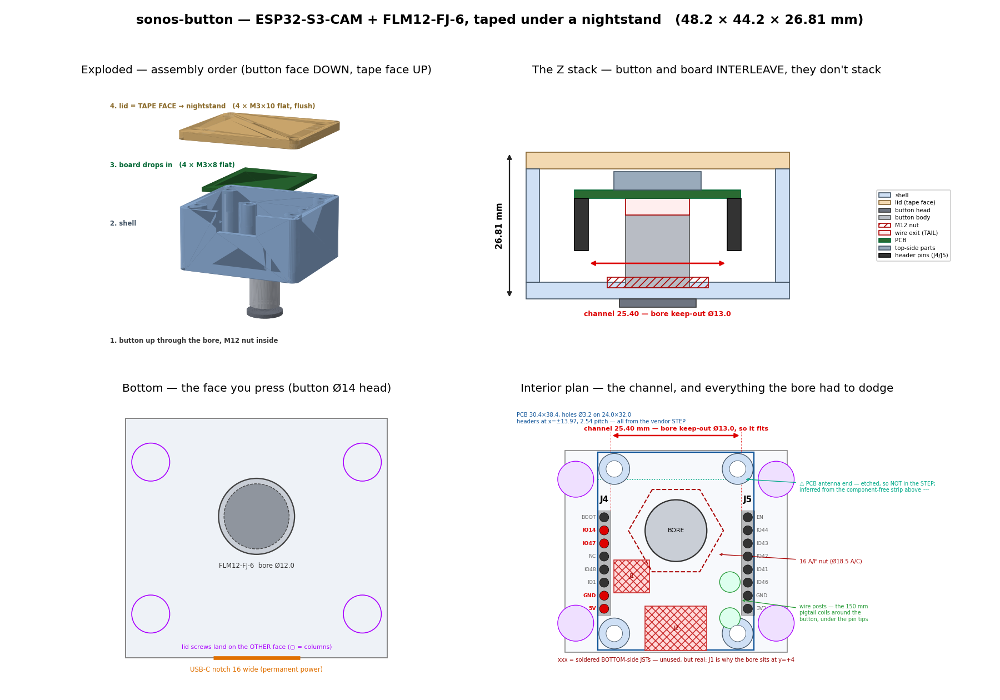

# cam-button — the `sonos-button` case

Enclosure for the third unit: a nulllab / emakefun **ESP32-S3-CAM** plus one **FILN
FLM12-FJ-6** pushbutton, in a box that **double-sided-tapes to the underside of a
nightstand, button facing DOWN**. You reach up, press, the Sonos sleep playlist starts.

Firmware plan (board facts, pinout, phases): **`plans/04-sonos-button-plan.md`**.

| | |
|---|---|
| **Overall** | **48.2 × 44.2 × 26.81 mm** — height is **derived**, never typed (see below) |
| **Tape face** | 48.2 × 44.2 = **2130 mm²**, flat, printed against the bed, **4 holes total** |
| Parts | `shell/shell.stl` + `shell/lid.stl` |
| Screws | **8 × M3 self-tapping** — the *same* screws as the sleep-machine |
| Camera | **removed** (it unplugs from its FPC connector) — no lens boss modelled |



---

## 1. The idea: the button **nests** between the header rows

The ESP32-S3-CAM's two 8-pin headers run down the **left and right edges** of the PCB with
a wide empty channel between them. The FLM12-FJ-6's Ø12 body lives **in that channel**, so
the button and the board interleave in Z instead of stacking. `plans/04` §6 costed the two
obvious layouts; this is a third:

| layout | height | floor |
|---|---|---|
| bore **over** the board | ~37.5 mm ❌ | small |
| bore **beside** the board (plan §6's pick) | ~23 mm | ~60 mm in one axis |
| **bore in the header channel** ← this case | **26.8 mm** | **48 × 44** |

Same ballpark height as "beside", in a markedly smaller footprint, because the button's
13.35 mm body and the board's 14.5 mm stack **overlap in Z instead of summing**.

### Does the button actually fit between the pins? **Yes — 6.20 mm of slack per side.**

This is the assumption the whole design rests on, so it is **measured, not assumed**, and
`build_shell.py` asserts it on every build rather than trusting this paragraph:

```
header rows        x = ±13.97      -> 27.94 mm centre-to-centre (= 11 × 2.54, exactly)
header plastic     2.54 wide       -> clear channel 25.40 mm
button keep-out    Ø12.0 + 2×0.5   -> Ø13.0
                                      slack = (25.40 - 13.0)/2 = 6.20 mm per side
```

**Where the ±13.97 came from:** the vendor's own KiCad STEP export
(`esp32s3_cam_3d.zip` → `esp32s3_cam.step`, from
[nulllaborg/esp32s3-cam](https://github.com/nulllaborg/esp32s3-cam) releases). The STEP has
**no header models** — J4/J5 have no 3D shape assigned, exactly as `plans/04` §6 predicted
— but the **board body itself carries the drilled holes**, and those are unambiguous: a
Ø0.85 grid, 8 holes per side, 2.54 pitch, at x = ±13.97, y = −11.19 … +6.59.

The only number in that chain not from CAD is the **2.54 header plastic width** (a standard
2.54 strip). It would have to be wrong by **>6 mm per side** to break the design, so the
conclusion is robust even though the input is estimated.

> **Bonus, free from the same drill grid:** it independently confirms `plans/04` §3's
> "**J4 pin 1 is at the BOTTOM**, nearest the USB-C". Pin 1 is at y = −11.19 (the USB end),
> pin 8 (BOOT) at y = +6.59. The four wires we use — **+5V, GND, IO47, IO14** = J4 pins
> 1, 2, 6, 7 — are at y = −11.19, −8.65, +1.51, +4.05 on **x = −13.97** (the USB-C's BOOT
> button is at −X in the STEP, so J4 is the −X row). See the interior plan in the preview.

---

## 2. Where every number came from

The honest ledger. **Read this before printing** — the ⚠️ rows are the ones that move metal.

### From the vendor STEP (as good as CAD gets, short of calipers)

| what | value | how |
|---|---|---|
| PCB outline | **30.4 × 38.4 × 1.60** | board solid spans exactly z 0.00–1.60 |
| mount holes | **Ø3.20** on **24 × 32** at (±12, ±16) | 4 × Ø3.2 bores + concentric Ø6.40 |
| mount keep-out | **Ø6.40** | the concentric circle at each hole |
| headers J4/J5 | **x = ±13.97**, 2.54 pitch, 8 each, y −11.19…+6.59 | Ø0.85 drill grid |
| tallest top-side part | **4.96** above the PCB **back** face (USB1, the USB-C shell) | next: U9 4.68, BOOT/RESET 4.17 |
| USB-C | centred (x ±4.79) on the −Y short edge, overhangs the PCB edge by **1.4 mm** | USB1 bbox |
| BOOT / RESET | top side, flanking the USB-C, 4.17 tall | B2 / B1 bboxes |
| **J1** batt JST | **bottom side**, x −12.08…−5.20, y −8.10…−1.70, hangs **4.53** | J1 bbox |
| **J2** PH2.0-4 | **bottom side**, x ±6.00, y −19.30…−10.69, hangs **5.55** | J2 bbox |

> **⚠️ This overturns `plans/04` §6's mounting-hole guess.** The plan reads the pads as
> "**M2 (Ø2.2), *not* M3 like the other two boards**". The vendor CAD says **Ø3.2 with a
> Ø6.4 pad** — a textbook **M3** mounting hole, identical to the ES3C28P's. That is why the
> sleep-machine's board screw drops straight in. **Still worth a caliper**, but CAD and the
> plan now disagree and CAD is the better witness.

### Measured by hand (`plans/04` §3) — the CAD cannot see these

| what | value | why CAD can't help |
|---|---|---|
| `BOARD_STACK_T` | **14.5** tip-to-tip | the STEP models only −5.55…+4.96 = 10.51, because it has **no header geometry** |

Everything else about the headers is derived from that 14.5: the lowest point sits
`14.5 − 4.96 = 9.54` mm below the PCB's back face, which leaves **5.81 mm** of coil space
under the pin tips.

### ⚠️ NOT VERIFIED — the real risk list

| # | flag | worth | status |
|---|---|---|---|
| 1 | **`BUTTON_BEHIND_T` 13.35 vs 11.85** — is the datasheet's 13.35 the *overall* length (head included) or the *behind-panel* depth? (`plans/04` §7.1a) | **1.5 mm of height** | 13.35 shipped — it errs **tall**, not short |
| 2 | **`BUTTON_TAIL_T` 3.0** — axial room behind the button for the wires to exit and turn. **The single most expensive unknown.** | **3 mm, or 9** | see below |
| 3 | **Which way the header pins protrude** (`plans/04` §7.3) | **~5 mm** | assumed **DOWN**; CAD cannot answer |
| 4 | `BUTTON_THREAD_L` 4.0 / `BUTTON_NUT_T` 2.0 → `BUTTON_PANEL_T` **2.0** (`plans/04` §7.1b) | the panel exists or it doesn't | drives the nut relief |
| 5 | `HDR_BODY` 2.54 — the header plastic width | 6.2 mm of slack | needs to be wrong by >6 mm to matter |
| 6 | **PCB antenna position** | RF only | **etched, so not in the STEP at all** — inferred from the only component-free strip (y > ~14, the +Y end) |
| 7 | `PCB_CORNER` R2 | nothing | the cavity is looser than the PCB on every side |
| 8 | `BUTTON_BORE_D` 12.0 | fit | FDM prints holes undersize — **test-coupon it** |

**On #2, the tail.** `plans/04` §6 budgets "**~9 mm** for the mated MX1.25 + pigtail bend",
reading the connector as sitting **on the button's back**. But a "4-pin MX1.25
**board-to-wire** pre-crimped 150 mm pigtail" normally means the connector is on the **far
end** of the wire and only bare wires leave the button — which is what your own budget
("~2 mm wall + 13.35 mm body ≈ 15.5 mm to the PCB's back face") assumes. **3.0 mm** is the
middle reading: enough for four limp 26 AWG PTFE strands to exit and turn 90°.

**It does not matter much, and that is the point** — every reading fits the 33 mm ceiling:

| scenario | `BEHIND` | `TAIL` | height |
|---|---|---|---|
| **shipped default** | 13.35 | 3.0 | **26.81** |
| body is really 11.85 | 11.85 | 3.0 | 25.31 |
| wires dress flat | 13.35 | 0.0 | **23.81** |
| both optimistic | 11.85 | 0.0 | **22.31** ✅ beats the 23 goal |
| MX1.25 *is* on the button back | 13.35 | 9.0 | **32.81** — still under 33 |
| header pins point **UP** instead (#3) | 13.35 | 3.0 | 31.95 — still under 33 |

**23 mm is reachable, but only if one of the two caliper checks goes the optimistic way.**
It is not reachable with both pessimistic: `2.0 + 13.35 + 4.96 + 0.5 + 3.0 = 23.81` even
with **zero** tail. Your arithmetic allotted 3.9 mm for top-side components; the measured
tallest is **4.96** (the USB-C shell), and that is not negotiable.

Change the two params in `shell/button_params.py`, re-run `build_all.py`, and the height
re-derives. It is **never typed in**.

---

## 3. Layout decisions

**Why the bore sits at (0, +4.0) and not (0, 0).** The board's **J1 battery JST** is
soldered to the *bottom* face at x −12.08…−5.20, y −8.10…−1.70. A Ø13 keep-out centred at
the board's origin overlaps it by ~1 mm. Pushing the bore to y ≥ **+2.20** clears it; **+4.0**
is used for margin (1.22 mm beyond the 0.5 clearance). `check_clearances()` in
`build_shell.py` proves this on every build. J1 and J2 are unused by this product but they
are *soldered on*, so they are hard obstructions — do not assume they'll be removed.

**⚠️ The button's metal body ends ~4 mm from the antenna strip.** At y = +4 the Ø12 body
reaches y = +10, and the component-free (probably antenna) end starts around y = +14. A
metal Ø14 button that close will detune a PCB antenna somewhat. It is also in a plastic box
under a wooden nightstand, so RF is already compromised. If range disappoints, `plans/04`
§6's IPEX mod (move a 0 Ω resistor) is the fix. Moving the bore further −Y is **not**
available: J1 is there.

**⚠️ You must SOLDER the four wires to J4 — DuPont crimps will not fit.** With the pins
pointing down, anything pushed onto them hangs from the header body at z = 15.81, and the
floor is at 3.0 → **12.81 mm of room**. A standard 2.54 DuPont female housing is ~14.7 mm
long. `build_shell.py` prints this budget; measure whatever housing you actually have
against it. Soldering is also what `plans/04` §6 assumes ("nothing but wire inside").

**The 150 mm pigtail coils around the button.** The annulus between the Ø13 keep-out and
the walls is ~69 mm around at r=11, so two turns swallow the ~135 mm of excess, and it all
sits **below the header pin tips** (5.81 mm of headroom). Two posts on the +X side hold the
coil down out of the board's way; J1 is on −X, which is why they are not there.

**The USB-C notch is open-topped on purpose.** USB-C here is *permanent power*, so the hole
clears a real **cable overmold** (16 mm wide), not the 9.58 mm connector. The connector's
axis sits ~21 mm up, so any opening generous enough would break the ceiling anyway; running
it to the rim instead lets the lid cap it and the shell prints **without a single bridge**.
It also makes room for the board's USB-C, which overhangs the PCB edge by 1.4 mm and pokes
into the wall line.

**The nut relief.** If the thread really is only ~4 mm (⚠️ #4), the nut eats 2 of it and
you get **2 mm of panel** — thinner than a sane printed wall. So the panel is **3.0 mm
everywhere but 2.0 at the bore**, via a Ø19.5 × 1.0 relief cut from the **inside**. That
(a) lets the thread reach a nut, (b) gives the nut a flat seat, and (c) leaves the outer
face flat. It prints with no support — it is a dish in the floor, not an overhang. The
Ø19.5 is the 16 A/F nut's **across-corners** (18.48) + 1.0, which is the real keep-out; the
nearest boss is 4.73 mm clear of it.

---

## 4. Screws (BOM)

**Deliberately the same hardware as the sleep-machine** (`../rec-2.8/countertop`) — that
board also has Ø3.2 corner holes, so the board screw is literally the same part. Everything
threads into bare printed plastic: use **self-tapping / thread-forming** screws (Plastite/PT
or generic coarse-thread). **No nuts, no heat-set inserts.**

| Where | Qty | Screw | Length | Head |
|---|---|---|---|---|
| **Board → shell** | 4 | M3 self-tapping | **8 mm** | **Flat** (≤5.4 mm OD, ≤1.5 mm tall) |
| **Lid → shell** | 4 | M3 self-tapping | **10 mm** | **Flat / 90° countersunk** |
| **Button** | 1 | M12 × 0.75 hex nut, 16 A/F | — | supplied with the FLM12-FJ-6 |

- **Board (4×): M3 × 8 flat-head.** PCB Ø3.2 holes → Ø2.6 boss pilots. **6.40 mm of bite**;
  keep the head ≤5.4 mm OD to stay inside the board's Ø6.4 keep-out ring. The head has
  2.36 mm of air under the lid, so head height is not critical here (unlike rec-2.8, where
  the bezel constrains it) — but ≤1.5 mm keeps the two units on one screw.
- **Lid (4×): M3 × 10 flat-head.** Ø2.6 pilots in the columns, **7.00 mm of bite**, Ø5.0
  countersink. rec-2.8 uses a **round** head on its bezel and offers flat as an option
  ("a 90° flat head seats flush if you prefer"). **Here flat is mandatory** — this face is
  the adhesive face, and a round head is a bump under the tape.
- Pilot sizes are `BOSS_PILOT` / `LID_POST_PILOT` in `button_params.py`; switch to M3
  heat-set inserts + machine screws there if you want repeated disassembly.

**Servicing a taped-down unit:** the 4 lid screws are under the tape. Peel the box off the
nightstand, unscrew, re-tape with fresh VHB. The 4 countersinks cost ~2 % of the adhesive
area and stay flush, so the tape still lands on a flat face.

**Four holes in the tape face, and only four** — `build_lid.py` asserts it (a plate with
*n* through-holes has Euler number 2 − 2*n*, so it checks for −6). An earlier draft added
BOOT/RESET paper-clip holes, per `plans/04` §6's "keep BOOT/RESET reachable … it costs
nothing". **On this unit it does cost something.** Both tacts are top-side, so the only
face they can be poked through is the adhesive face — and poking through the tape was
never a real recovery path, because you cannot reach the lid without peeling the box off
the nightstand, and once it is off the four screws are right there. They would also be
dead weight after one use: only the *first* USB flash needs download mode, and that is
done with the case open; after that auto-reset and `/ota` take over. Two permanent holes
in the one surface that must be an uninterrupted slab, to save nothing. Cut.

---

## 5. Print

| part | orientation | supports |
|---|---|---|
| **shell** | **button face DOWN** on the bed (as modelled, z=0 down) | **none** |
| **lid** | **TAPE FACE DOWN** on the bed | **none** |

- **shell:** the bore and every pilot are vertical holes; the bosses, ribs and columns rise
  from the bed; the nut relief is a dish in the floor; the USB notch is open-topped. Nothing
  bridges, nothing overhangs. ~19.0 cm³.
- **lid:** tape face **down** puts the adhesive on a bed-smooth surface — the best face an
  FDM printer can make, and the whole point of the part. The countersinks then open
  **upward** and need no support. ~6.2 cm³.
- PLA/PETG both fine, 0.2 mm layers. This is a static compression part (pressing the button
  pushes the case **up** into the nightstand), so **15 % infill is plenty**.
- **Test-coupon the bore first.** FDM prints holes undersize; `BUTTON_BORE_D` = 12.0 is
  thread (11.71) + 0.3. Print a 5 mm slab with the bore and check the button threads through
  before committing the shell.

---

## 6. Files

```
cam-button/
    README.md              <- you are here
    shell/
        button_params.py   every dimension; the height is DERIVED at the bottom
        build_shell.py     shell.stl  + check_clearances() (asserted on every build)
        build_lid.py       lid.stl
        build_all.py       both
        render_preview.py  render_preview.png
        shell.stl  lid.stl  render_preview.png
```

Same toolchain as the rest of `hardware/` — **Python CSG (trimesh + manifold3d)**, not
OpenSCAD:

```bash
cd shell && conda run -n img23d python build_all.py     # -> shell.stl + lid.stl
conda run -n img23d python render_preview.py            # -> render_preview.png
```

`button_params.py` is the single source of truth: the button and board numbers sit
**upstream** and `HEIGHT` falls out of them as
`(THREAD_L − NUT_T) + BEHIND_T + TAIL_T + COMP_Z_MAX + TOP_CLR + LID_T`. Changing a button
measurement changes the box; there is no independent height to forget to update.

`build_shell.py` refuses to build if any clearance fails. Run it alone to see the table:

```
$ conda run -n img23d python build_shell.py
  OK  button body -> header row (each side)        6.20   0.00  mm
  OK  button body -> J1 batt PH2.0-2               1.22   0.00  mm
  ...
  OVERALL HEIGHT                  26.81 mm   (target 23, ceiling 33)
```

## 7. Still open

1. **Caliper the button** — behind-panel depth (13.35 vs 11.85?), thread length, nut
   thickness, and what actually leaves the back (bare wires, or an MX1.25 housing?).
   Answers #1, #2 and #4 above, and are worth up to 9 mm of height.
2. **Caliper a mount hole** — CAD says Ø3.2/M3, `plans/04` §6 guessed M2. Cheap to settle.
3. **Which way do the header pins protrude** (`plans/04` §7.3) — CAD cannot answer it; this
   case assumes **down**.
4. **Confirm the camera comes off** (`plans/04` §7.5) — no lens boss is modelled.
