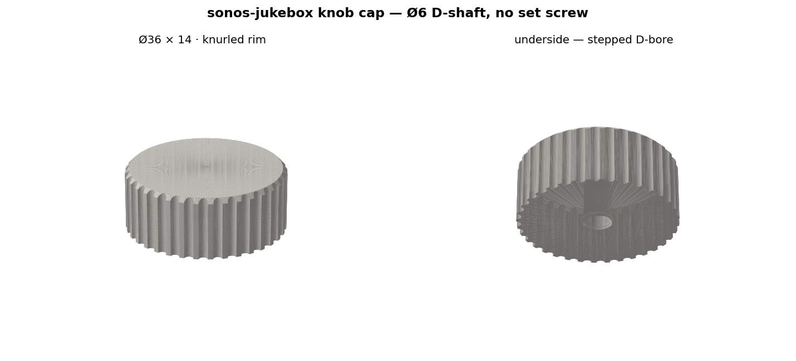

# jukebox-7 / wall — flush wall case

Two printed parts for the sonos-jukebox 7" unit: a rear **shell** that holds the board and
carries the wall mount, and a front **face** plate with the screen opening and the control column.

```bash
conda run -n img23d python build_all.py         # -> shell.stl, face.stl
conda run -n img23d python render_preview.py    # -> assembly_preview.png
conda run -n img23d python check_clearances.py  # asserts nothing collides; exit 1 on failure
```

**Run `check_clearances.py` after touching any parameter.** It exists because a face-plate screw
boss was once sitting on top of the PCB's bottom-left mounting boss — and underneath the PCB
itself. That is invisible in an STL until you happen to look into the corner.

All geometry comes from [`case_params.py`](case_params.py). Board numbers come from
[`../crowpanel-p4-7-physical-spec.md`](../crowpanel-p4-7-physical-spec.md).


## The design

| | |
|---|---|
| Face | **230 × 128 mm**, R14 corners |
| Depth | **22.0 mm** — lands exactly on the design system's `--u7-depth` token |
| Screen | 155 × 87 opening, 1 mm rebate onto the black border |
| Face fixing | **6 magnets, no screws** — nothing breaks the front surface |
| Column | 45.6 mm wide on the right: Ø36 dial at the top, 2×2 Ø13 buttons below |
| Mount | 2 keyholes in the top band, **140 mm apart**, 5.5 mm drop |
| Power | USB-C breakout on edge at the bottom of the column → 2 wires to J10 |
| Print | Bambu P2S; both parts lie flat, face printed front-face-down |

### Depth stack

```
   0.0  rear outer plane (against the wall)
   2.5  interior floor            rear wall 2.5
   3.0  rear-most component       + clearance 0.5
  19.5  glass front plane         + envelope 16.5  (MEASURED)
  22.0  face plate outer          + face 2.5
```

### Why the face is 128 mm and not 112

Only ~3 mm sits behind the PCB, so **nothing that needs depth can go where the board is** — not a
keyhole's captured screw head, not the 4.75 mm USB-C breakout, and **not a face-plate screw boss**,
which runs the full interior height.

The face therefore needs a band above *and* below the PCB. The top band (12.5 mm) carries the two
keyholes. The bottom band was first drawn at 6 mm, which left only 3.75 mm of free strip — too thin
for any boss, so the entire bottom edge of the face plate had no fixing for 215 mm, under a 155 mm
screen opening with a ~7 mm strip beneath it. At **10 mm** it takes proper bosses.

**Face screws are in the bands, three across each** (`FSCREW_X`), never over the PCB, and clear of
the keyholes and the USB-C plate. `check_clearances.py` asserts all of it.

### Why keyholes, and why they don't rock

The unit sits **flush to the wall**, so pressing a button pushes it *into* the wall rather than
levering it off. The two keyholes only have to stop it sliding and swinging, which 140 mm of
separation does comfortably. No cleat, no backplate, **0 mm added depth** — which was the brief.

### The USB-C breakout, and why its datum is the rear plane

The board stands **on edge** with the receptacle pointing at the wall, so its 14.5 mm axis runs
front-to-back:

```
   0.0  receptacle mouth   flush with the rear plane, against the wall
  14.5  rear edge of the breakout PCB
  19.5  face plate inner surface
        ─────────────────────────────
   5.0  mm headroom
```

The receptacle **nests into the 2.5 mm rear wall** rather than competing with it. Seating the board
on the interior floor instead would recess the mouth 2.5 mm and force the plug's overmold into the
port cutout before it could seat — the correct datum is `UC_Z0 = 0`, the outer rear plane.

It mounts on a **single bare plate**, screwed through its two post holes — not trapped in a slot,
and with **no lip or roof over the board**. The two screws run along **X**, so a driver can only
reach them from the side; anything overhanging the board's outer face sits directly in its path.

Which face of the plate the board lands on is `UC_BOARD_SIDE` (+1 / −1). The port centreline stays
on `UC_CX` either way, so flipping it moves only the board and the plate — not the hole you drill in
the wall.

> **Flipping alone does not buy clearance.** `UC_CX` is the column centre, so the two sides are
> mirror images: 21.25 mm of open column on the screw side either way. To actually gain room, shift
> `UC_CX` *away* from the screw side. With the board on the −X face, moving the port to x ≈ 214
> opens the screw side to **~31 mm** — but it also moves the wall's cable hole ~10 mm right, so it
> is a deliberate choice rather than a default. `check_clearances.py` asserts at least 12 mm and
> warns below 18.

The port cutout is sized to the **receptacle body** (8.94 × 3.26), not to the plug — the plug's
overmold stays out in the wall's cable hole and never enters this opening.

**Which axis is which** — this was wrong twice, so it is spelled out. The board stands **on edge**,
its plane perpendicular to the wall, i.e. the plane containing Y and Z. The receptacle is mounted on
that face, so its **long axis (8.94) lies in the board's plane and runs ALONG the column (Y)**. Its
short axis (3.26) is the board's normal, **across** the column (X).

| | |
|---|---|
| Across the column (`PORT_W`) | **5.0** — clears the 3.26 depth, 0.87 mm each side |
| Along the column (`PORT_H`) | **17.0** — clears the 8.94 length, 4.03 mm each side |
| Funnel (`PORT_FUNNEL`) | **2.5** on the wall side only → outer opening 10.0 × 22.0 |

> The first print had 14.0 × 8.0 with a 4.0 funnel — sized to the *plug*, and with the receptacle's
> orientation transposed. `check_clearances.py` now asserts `PORT_H > PORT_W`, so the long axis
> cannot silently end up across the column again. It warns (does not fail) that 0.87 mm each side on
> the short axis is tight — deliberately so. If the receptacle will not bed down, `PORT_W` is one
> parameter.

The plug then behaves the way the install wants: its nose travels ~6.5 mm into the receptacle inside
the case while the **overmold stays in the wall's cable hole**, so the cable pushes back in once
mated. The wall hole only has to clear the overmold, not the whole connector.

### Power routing

`J10` (`+5V_IN`) is at the **far left** (front-x ≈ 6.2), the breakout is at the **bottom right** of
the column. The two-wire run crosses the width in a recessed channel in the interior floor so the
pair is not pinched under the PCB. The rear port is deliberately **oversized with a 4 mm outward
funnel**, so the hole drilled in the wall does not have to be precisely placed.

## ⚠️ Provisional — do not print the face for final fit yet

**`AA_X0` / `AA_Y0` are a centred guess.** Where the lit area actually sits on the PCB has not been
measured, and it is the only thing that moves the screen opening. Measure the four gaps from the PCB
edges to the lit area (screen powered), set those two values, flip `AA_MEASURED = True`, and rebuild.
The shell is unaffected.

Also VERIFY before a final print, per `hardware/README.md` convention:

- **`REAR_COMP_H`** (5.5 assumed) — PCB rear face to the rear-most component. Only the **boss
  height** depends on it; everything else references the measured glass plane.
- **USB-C breakout hole Ø and centres** — photo-scaled, not measured.
- **Edge-connector heights and any outward overhang** past the PCB outline — sets the side walls.

### The encoder board sits on standoffs, not on the floor

The Arduino Modulino Knob carries a Bourns PEC11J-9215F-S0015, whose shaft is **15 mm from the
bushing flange** on top of a ~6.5 mm body — roughly **21.5 mm from the Modulino PCB to the shaft
tip**. Mounted flat on the case floor the shaft would clear the face by only ~2 mm, into a cap that
is 14 mm deep. So it rides on four standoffs at `KNOB_PCB_Z = 8.5`.

The board is positioned **from the shaft tip down** (`KNOB_TIP_Z = 30.0`, giving 8 mm of engagement
into the cap) rather than from the floor up, because `KNOB_BODY_H` is the only estimate in that
chain. Measure "shaft tip above the Modulino PCB" once, put it in `KNOB_STACK_H`, and the standoffs
correct themselves.

Standoffs are on the datasheet's **32 × 16 mm** pattern, centred on the dial. The 41 mm board fits
the 45.6 mm column with 2.3 mm either side.

## The magnet mount has two bore levels, on purpose

Looking into a magnet post you see a **stepped hole**, not a plain magnet pocket:

```
  19.5 ┬──────────────┬  mating plane / top of the post
       │   Ø8.6       │  receives the face plate's SPIGOT   (4.0 deep)
  15.5 ├───┬──────┬───┤  magnets meet here, face to face
       │   │ Ø6.3 │   │  the magnet itself                  (2.2 deep)
  13.3 ┴───┴──────┴───┴
```

The wide upper bore is not slop around the magnet — it is a **socket for the face plate**.

The face plate is 2.5 mm thick, so a 2.2 mm magnet pocket sunk into it would leave a
**0.3 mm skin** on the visible front surface. Instead the plate's magnet sits in a boss that
drops 4 mm below the mating plane, and the shell has to receive that boss. Three things fall
out of it: 4.3 mm of material over the disc instead of 0.3, the two discs meet **face to face
with no plastic in the gap** (roughly double the pull of a through-plastic pair), and the six
spigots **register the plate** so it cannot slide — which matters because magnets are weak in
shear and this one hangs on a wall.

If you would rather have a plain single-diameter pocket, the cost is: `FACE_T` 2.5 → 3.5 (so
the case gets 1 mm deeper, 22 → 23), magnets separated by ~1.2 mm of plastic instead of
touching, and separate locating pins to replace the lost registration. Say the word.

## Knob cap — `build_knob_cap.py`



Ø36 × 14 mm, knurled rim, **no set screw and no hardware** — a D-bore keys it directly to the
encoder shaft.

**The bore is stepped, and that step is load-bearing.** Only the top 5 mm of the Bourns shaft is
flatted; below that it is round Ø6. A D-bore running the full depth would jam on that round
section and never seat, because the flat is 4.5 mm across — narrower than the Ø6 it would have
to pass over. So the bore is **round for its first 3.5 mm, D above it**.

| | |
|---|---|
| Bore | Ø6.0 + 0.25, round 3.5 mm then D at 4.5 + 0.25 across |
| Engagement | 7.5 mm of shaft in an 8.5 mm bore (1 mm of air above the tip) |
| Sits | z 22.5 – 36.5, i.e. 0.5 mm off the face so it cannot rub |

**Print it top-face-down.** The bore then opens upward as a plain vertical hole — no overhang,
no supports — and the visible top face is laid against the bed.

The face's dial hole also changed: it is now **Ø9**, clearing only the encoder's Ø7 bushing,
so the Ø36 cap overhangs it by **13.5 mm all round**. It was Ø37 (sized to the cap), which left
a 37 mm hole you could see straight into with the cap floating inside it.

If `KCAP_FIT` comes out tight or loose on your printer, it is one parameter.

## Not yet modelled

The **buttons have holes but no internals** — switch bodies are still unselected, so there are no
mounts or plungers. The **I2C GPIO breakout** for the button wires is also unchosen; check its
address against 0x5D (touch), 0x2F (unidentified) and 0x76 (the Knob).

`BTN_PITCH` is currently 22 mm (Ø13 caps + a 9 mm gap) — note the design token `--btn-gap: 9mm` is
labelled "centre-to-centre", which is geometrically impossible with Ø13 caps; it has been read as
the gap.

No **light-pipe** for the dial's RGB ring; the design system lists one as an open question and the
Modulino Knob has no LEDs.

Also unresolved: whether the case exposes **BOOT/RESET** (front-x ≈ 172.6, right against the column,
so a hidden port through the column cavity is plausible) and **microSD** (front-x ≈ 159.7).
