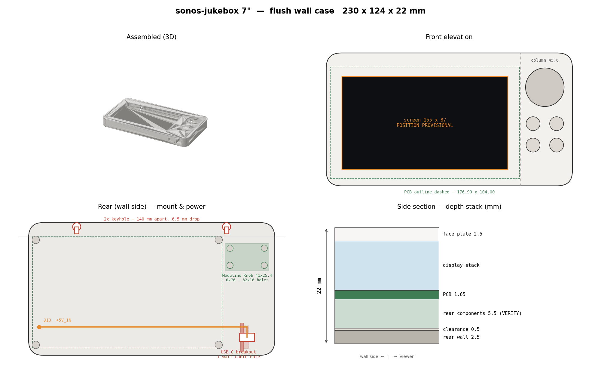

# jukebox-7 / wall — flush wall case

Two printed parts for the sonos-jukebox 7" unit: a rear **shell** that holds the board and
carries the wall mount, and a front **face** plate with the screen opening and the control column.

```bash
conda run -n img23d python build_all.py       # -> shell.stl, face.stl
conda run -n img23d python render_preview.py  # -> assembly_preview.png
```

All geometry comes from [`case_params.py`](case_params.py). Board numbers come from
[`../crowpanel-p4-7-physical-spec.md`](../crowpanel-p4-7-physical-spec.md).



## The design

| | |
|---|---|
| Face | **230 × 124 mm**, R14 corners |
| Depth | **22.0 mm** — lands exactly on the design system's `--u7-depth` token |
| Screen | 155 × 87 opening, 1 mm rebate onto the black border |
| Column | 45.6 mm wide on the right: Ø36 dial at the top, 2×2 Ø13 buttons below |
| Mount | 2 keyholes in the top band, **140 mm apart**, 6.5 mm drop |
| Power | USB-C breakout on edge at the bottom of the column → 2 wires to J10 |
| Print | Bambu P2S; both parts lie flat, face printed front-face-down |

### Depth stack

```
   0.0  rear outer plane (against the wall)
   2.5  interior floor            rear wall 2.5
   3.0  rear-most component       + clearance 0.5
  19.5  glass front plane         + envelope 16.5  (MEASURED)
  22.0  face plate outer          + face 2.5
```

### Why the face is 124 mm and not 112

Only ~3 mm sits behind the PCB, so **nothing that needs depth can go where the board is** — not a
keyhole's captured screw head, not the 4.75 mm-thick USB-C breakout. Growing the face by 12 mm
creates a **12.5 mm top band** with no PCB behind it, which is where the keyholes live and where the
screw heads have the full interior to sit in. The 6 mm bottom band balances it visually.

### Why keyholes, and why they don't rock

The unit sits **flush to the wall**, so pressing a button pushes it *into* the wall rather than
levering it off. The two keyholes only have to stop it sliding and swinging, which 140 mm of
separation does comfortably. No cleat, no backplate, **0 mm added depth** — which was the brief.

### The USB-C breakout, and why its datum is the rear plane

The board stands **on edge** with the receptacle pointing at the wall, so its 14.5 mm axis runs
front-to-back:

```
   0.0  receptacle mouth   flush with the rear plane, against the wall
  14.5  rear edge of the breakout PCB
  19.5  face plate inner surface
        ─────────────────────────────
   5.0  mm headroom
```

The receptacle **nests into the 2.5 mm rear wall** rather than competing with it. Seating the board
on the interior floor instead would recess the mouth 2.5 mm and force the plug's overmold into the
port cutout before it could seat — the correct datum is `UC_Z0 = 0`, the outer rear plane.

It mounts on a **single flat plate**, screwed through its two post holes — not trapped in a slot
between two ribs. One face to register against, two M3 self-tap pilots, and it can be fitted or
removed without springing anything. The plate is offset `UC_REC_OFF` from the port centreline so the
receptacle lands on the port; a small lip at the front edge stops the board rotating on one screw.

The plug then behaves the way the install wants: its nose travels ~6.5 mm into the receptacle inside
the case while the **overmold stays in the wall's cable hole**, so the cable pushes back in once
mated. The wall hole only has to clear the overmold, not the whole connector.

### Power routing

`J10` (`+5V_IN`) is at the **far left** (front-x ≈ 6.2), the breakout is at the **bottom right** of
the column. The two-wire run crosses the width in a recessed channel in the interior floor so the
pair is not pinched under the PCB. The rear port is deliberately **oversized with a 4 mm outward
funnel**, so the hole drilled in the wall does not have to be precisely placed.

## ⚠️ Provisional — do not print the face for final fit yet

**`AA_X0` / `AA_Y0` are a centred guess.** Where the lit area actually sits on the PCB has not been
measured, and it is the only thing that moves the screen opening. Measure the four gaps from the PCB
edges to the lit area (screen powered), set those two values, flip `AA_MEASURED = True`, and rebuild.
The shell is unaffected.

Also VERIFY before a final print, per `hardware/README.md` convention:

- **`REAR_COMP_H`** (5.5 assumed) — PCB rear face to the rear-most component. Only the **boss
  height** depends on it; everything else references the measured glass plane.
- **USB-C breakout hole Ø and centres** — photo-scaled, not measured.
- **Edge-connector heights and any outward overhang** past the PCB outline — sets the side walls.

### The encoder board sits on standoffs, not on the floor

The Arduino Modulino Knob carries a Bourns PEC11J-9215F-S0015, whose shaft is **15 mm from the
bushing flange** on top of a ~6.5 mm body — roughly **21.5 mm from the Modulino PCB to the shaft
tip**. Mounted flat on the case floor the shaft would clear the face by only ~2 mm, into a cap that
is 14 mm deep. So it rides on four standoffs at `KNOB_PCB_Z = 8.5`.

The board is positioned **from the shaft tip down** (`KNOB_TIP_Z = 30.0`, giving 8 mm of engagement
into the cap) rather than from the floor up, because `KNOB_BODY_H` is the only estimate in that
chain. Measure "shaft tip above the Modulino PCB" once, put it in `KNOB_STACK_H`, and the standoffs
correct themselves.

Standoffs are on the datasheet's **32 × 16 mm** pattern, centred on the dial. The 41 mm board fits
the 45.6 mm column with 2.3 mm either side.

## Not yet modelled

The **buttons have holes but no internals** — switch bodies are still unselected, so there are no
mounts or plungers. The **I2C GPIO breakout** for the button wires is also unchosen; check its
address against 0x5D (touch), 0x2F (unidentified) and 0x76 (the Knob).

`BTN_PITCH` is currently 22 mm (Ø13 caps + a 9 mm gap) — note the design token `--btn-gap: 9mm` is
labelled "centre-to-centre", which is geometrically impossible with Ø13 caps; it has been read as
the gap.

No **light-pipe** for the dial's RGB ring; the design system lists one as an open question and the
Modulino Knob has no LEDs.

Also unresolved: whether the case exposes **BOOT/RESET** (front-x ≈ 172.6, right against the column,
so a hidden port through the column cavity is plausible) and **microSD** (front-x ≈ 159.7).
