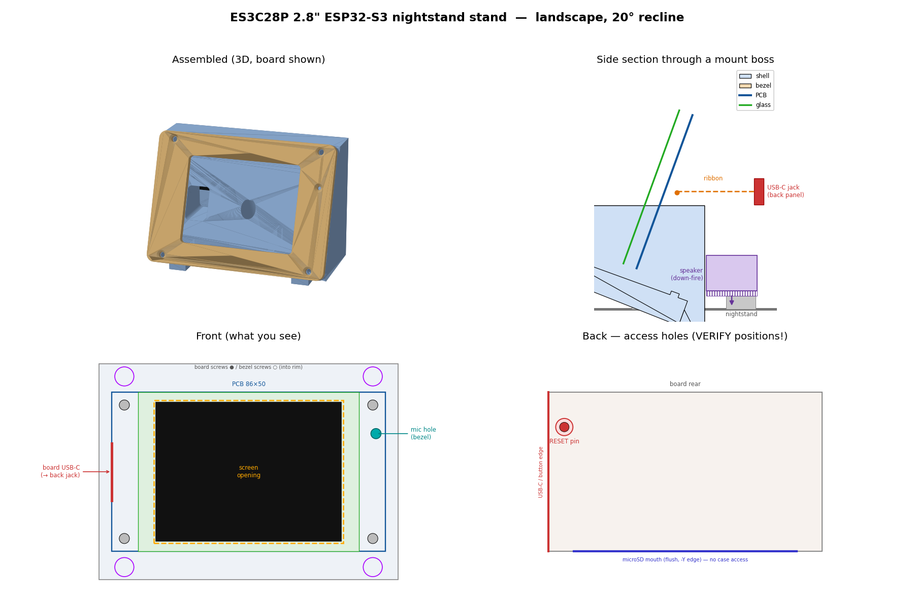

# ES3C28P nightstand stand case

A 3D-printed **angled nightstand stand** for the **Hosyond / LCDWIKI ES3C28P**
2.8" ESP32-S3 display board (the SD-card-equipped board for the second Sonos
controller). Two printed parts:

| part | file | what it is |
|------|------|-----------|
| **shell** | `shell.stl` | wedge body; board drops into a reclined pocket and screws to 4 bosses |
| **bezel** | `bezel.stl` | screwed-on front frame that covers the board edges + screws and frames the screen |
| **speaker cap** | `speaker_cap.stl` | snap-in cap that closes the rear speaker load port and backs the speaker in |

Orientation: **landscape** (86 mm wide, 50 mm tall), **reclined 20° from vertical**.



## Board it fits (verified)

All numbers come from the QDtech **"LCM OUTLINE" drawing** (`ES3C28P_Size.pdf`,
V1.0 2025-06-11) and the LCDWIKI wiki — not guessed:

- PCB **86.0 × 50.0 × 1.6 mm**, corner radius **R3.5**
- **4× Ø3.2** mounting holes on a **42 × 78 mm** rectangle (4 mm in from each edge),
  Ø5.6 keep-out ring around each
- front glass protrudes **4.30 mm**; glass 50 × 69.2 mm (full board width)
- viewing area 43.60 × 58.05; active area 43.20 × 57.60
- back components up to **4.70 mm**; total module thickness **10.60 mm**
- USB-C + RESET + BOOT on **one short (50 mm) edge**; RESET/BOOT are back-face buttons
- **microSD** is a push-push socket on the back whose card **mouth is flush with the
  −Y (bottom, 86 mm) long edge** → the card enters from beyond that edge, sliding up
  under the PCB. Not reachable from the rear.

## Features

- **Board mount:** 4 self-tapping screws (M3, ~10 mm) from the front through the PCB
  corner holes into printed **bosses** (Ø2.6 pilot). Heads sit on the bare PCB corners,
  hidden by the bezel.
- **Bezel:** sits **flush** on a continuous raised **rim** around the screen (the rim
  top is level with the glass, so there's no gap). 4 countersunk screws (M2.5/M3) land
  in the top/bottom rim band. Bezel outer == shell face outline, so the edges align.
  Screen opening exposes the viewing area (VA + 0.7 mm/side).
- **Rear panel-mount USB-C jack:** a flat right-angle USB-C male (JUXINICE-style) plugs
  into the board's USB-C on the −X edge, and its short flat ribbon routes through an
  internal pocket to a **female panel-mount jack bolted to the back wall** — a clean,
  fixed plug-in port facing the rear. Back-wall features: a flush **25.2 × 8.2 mm flange
  recess** and **2 × Ø2.1 pilots at 17 mm** for the connector's M2.5 mounting screws,
  with a body/ribbon pocket behind that drops down and forward into the board cavity.
  The jack sits on the **−X side of the back, ~level with the board's USB-C** — a short
  ribbon run; the pocket is kept **12 mm wide** so the
  17 mm screws bite full plastic.
  The board's own USB-C (on the −X edge) is used only for this internal link — there is
  **no external side port**; the −X exterior is closed (`USB_SKIN` skin) with a **blind
  clearance pocket** inside for the right-angle plug. Pre-plug the male before dropping
  the board in. It leaves ~**2.5 mm** of −X clearance past the board edge, so if the plug
  is deeper, set `USB_SKIN = 0` to reopen a slim slot (or ask me to bump the −X wall out).
- **Microphone hole:** Ø2 mm port through the bezel over the board's front-facing MEMS
  mic (near the +X edge, opposite the connectors), with a Ø4.5 **funnel countersink** on
  the visible face for cleaner sound pickup.
- **Speaker (kit's ~20×15 box, 8 Ω / ~1 W):** **downward-firing** pocket in the solid
  back of the wedge, **loaded from the rear**, firing through an integral **grille** in
  the base. Four **feet** lift the base 4 mm for the air gap. A wire channel connects the
  pocket up to the board's SPEAKER header. The box speaker is self-enclosed, so no sealed
  chamber is needed. The speaker sits at the front of the pocket; a **snap-in cap**
  (`speaker_cap.stl`) closes the rear load port, backs the speaker in, and clicks into two
  catch recesses in the pocket walls. The hooks are **arrow-profiled (lead-out ramps)** and
  the plate has a **fingernail pull-tab** on its bottom edge — hook a nail/spudger under
  the tab and pull straight back to cam the hooks out and pop the cap off; press to reseat.
- **RESET pin hole:** Ø3 channel bored straight back through the body to the RESET
  button (7.0 mm centre-to-centre from its corner screw hole) — poke a paper-clip from
  the rear.
- **microSD: no case access — by design.** The socket's card mouth is flush with the
  board's bottom long edge, so the card enters up-incline from underneath the PCB. That
  path is unreachable from the rear and is blocked by the face's bottom lip, so the case
  provides **no card opening** and the back wall stays solid. Swap the card with the
  board out of the case. (Content is expected to be written once; the unit streams from
  Sonos in normal use.)
- **20° recline** on a flat base for nightstand viewing.

## Screws (BOM)

Everything threads directly into printed plastic bosses — use **self-tapping /
thread-forming screws** (for plastic: Plastite/PT or generic coarse-thread self-tappers).
**No nuts or heat-set inserts** required.

| Where | Qty | Screw | Length | Head |
|-------|-----|-------|--------|------|
| **Board → case** | 4 | M3 self-tapping | ~8 mm | Pan (≤5.4 mm OD) |
| **Bezel → case** | 4 | M3 self-tapping | ~8–10 mm | Countersunk / flat |
| **USB-C jack → case** | 2 | M2.5 self-tapping | ~5–6 mm | Pan — *usually included with the cable* |

- **Board (4×):** PCB Ø3.2 corner holes → Ø2.6 boss pilots (M3). From the front through
  the PCB (1.6 mm) into the boss (~6–7 mm bite); keep the head **≤5.4 mm** to stay inside
  the board's Ø5.6 keep-out ring. Install *before* the bezel.
- **Bezel (4×):** countersunk holes → Ø2.6 rim pilots (M3), flat head to sit flush. The
  countersink is modeled Ø5.0, so a low-profile/90° flat head seats best (`BEZEL_SCREW_HEAD`
  widens it if needed).
- **USB-C jack (2×):** female flange Ø2.5 holes at 17 mm → Ø2.1 case pilots (M2.5). The
  JUXINICE panel-mount cable ships with its two mounting screws — reuse those.
- **No screws** for the speaker cap (snap-in) or the speaker (trapped by the cap).

Pilot sizes are `BOSS_PILOT` / `POST_PILOT` / `PANEL_SCREW_PILOT` in `stand_params.py`;
switch to M3 heat-set inserts + machine screws there if you prefer repeated disassembly.

## Sourcing

- **Board** (Hosyond ES3C28P 2.8" ESP32-S3): https://www.amazon.com/dp/B0FKG7WRWV
- **Rear USB-C jack** (JUXINICE flat right-angle male → female panel mount, ships with its
  2 mounting screws): https://www.amazon.com/JUXINICE-Type-C-Female-Adapter-Extension/dp/B0GTDF6D1Y

## ⚠️ Verify before the final print

The board **outline, holes, glass, and thickness are exact**. But the in-plane
positions of the **USB-C and RESET** are **estimated from the board photos** (the
outline drawing does not dimension them). The cut-outs are drawn generously, and
each is a one-line parameter in `stand_params.py`:

```
USB_Y, USB_SLOT_Y/Z        # board USB-C slot on the -X edge (right-angle male clearance)
PANEL_Z, PANEL_*           # rear panel-mount jack: position, flange, cutout, screws
RESET_X                    # RESET button along the board width  (still estimated)
RESET_Y                    # MEASURED: 7.0 mm c-to-c from the (-39,+21) corner hole
MIC_X, MIC_Y               # front MEMS mic port (bezel hole)
SPK_W, SPK_L, SPK_T        # included speaker box size (measure the real one)
```

**microSD needs no verification** — the case has no card opening, so nothing has to
line up with the socket.

Also confirm the **mic is front-ported** (the outline drawing shows a front "MIC"
port). If it turns out to be rear-ported, move the hole from `build_bezel.py` to the
shell back instead.

Put calipers on a real board, update those, and re-run. `assembly_preview.png` plots
them on a board map so you can eyeball the alignment first. Print the **bezel + a thin
test slab of the shell face** first to check screen framing and hole registration
before committing to the full ~2 h shell print.

## Build

Uses the same Python CSG toolchain as `../../round-nest-2.8/wall` (trimesh + manifold3d). On this
machine that lives in the `img23d` conda env:

```bash
conda run -n img23d python build_all.py       # -> shell.stl, bezel.stl, speaker_cap.stl
conda run -n img23d python render_preview.py  # -> assembly_preview.png
```

Everything is parametric in `stand_params.py` (tilt, margins, wall/boss/post sizes,
screw pilots, cut-out positions). `build_shell.py` and `build_bezel.py` both import it
so the two parts can't drift.

## Print notes

**Infill:** not part of the STL — it's a slicer setting you pick at print time. The
shell models as a *solid* ~133 cm³ block; the slicer fills the interior at whatever
infill you choose. This is a static compression part, so **15 % is plenty** (20 % if you
want extra heft/stability). At 15 %, ~3 walls, expect roughly **~65 g of PLA and ~2 h**
for the shell; the bezel is ~10 g / ~25 min. There's no need to hollow the model —
infill handles the weight.

- **shell:** print base-down (as modeled, on the feet). The reclined face self-supports;
  the boss pilots and jack cutout print cleanly. The **speaker pocket** is a rear-loaded
  cavity — its ceiling bridges ~15 mm, so enable bridging (or a little support) for that
  one region. The rear reset/speaker openings exit low on the back.
- **bezel:** print flat, face-down; the countersinks are on the up-face.
- **speaker cap:** print plate-down (arms/hooks + pull-tab up). Fit/retention tuning:
  `CAP_CLR` (looser = easier), `CAP_HOOK`/`CAP_HOOK_RAMP` (retention strength vs pry effort).
- PLA/PETG both fine. 0.2 mm layers. Screws: M3 self-tapping for the board/bosses,
  M2.5–M3 for the bezel.
